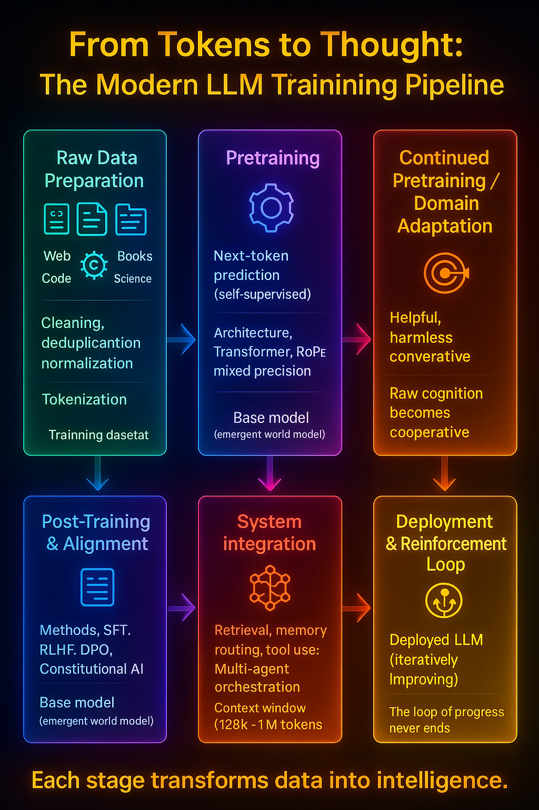

## 1. Overview {#overview}

Every major foundation model—GPT, Claude, Gemini, Llama, Mistral—passes through a three-phase evolution:
**pretraining**, **continued pretraining**, and **post-training.**
Each stage expands a model’s intelligence from pattern recognition to reasoning and alignment.

## 2. Stage 1 — Pretraining {#pretraining}

### Objective
Self-supervised learning on vast text corpora using the **next-token prediction** objective:
\[
L = - \sum \log P(x_t | x_{<t})
\]
The model learns to predict the next symbol in a sequence, which forces it to compress world-level regularities—language, logic, and cause-effect structure—into weights.

### Data Scale
- Typical scale: **1–30 trillion tokens**, drawn from filtered internet Natural langauge(web articles,books,academic papers),code,Mathematical equations, genetic code(genomes,DNA,RNA) 
- Diversity is key: linguistic, cultural, and domain variety yields richer latent representations. 
- Deduplication, normalization, and heuristic filters remove noise and contamination.

### Architecture
- Transformer backbone (decoder-only or hybrid). 
- Positional encodings (usually RoPE). 
- Optimization with AdamW or Lion; mixed-precision training and distributed parallelism across thousands of GPUs.

### Emergent Structure
As the model minimizes next-token loss, **higher-order structure** emerges:
- Syntax → semantics → discourse → reasoning precursors 
- Implicit world models and factual recall 
- Token embeddings align semantically in latent space 

### Limitations
Pretraining teaches **knowledge**, not **behavior**. 
The model predicts patterns but has no understanding of correctness, safety, or user intent.

## 3. Stage 2 — Continued Pretraining / Domain Adaptation {#continued-pretraining}

After base training, models are often *refined* on curated corpora.

### Goals
- Extend context window (e.g., 128k–1M tokens). 
- Add specialized domains (code, math, scientific papers, multimodal data). 
- Improve factual retention and robustness. 

### Techniques
- Continued next-token prediction on domain-specific data. 
- Synthetic data augmentation (self-generated Q/A or dialogue). 
- Mixture-of-Experts scaling to expand capacity without linear compute growth.

### Outcome
This stage transforms a generic foundation model into a **high-fidelity domain model**—capable of reasoning in specific technical, legal, or creative contexts.

## 4. Stage 3 — Post-Training & Alignment {#post-training}

The final training layer converts the pretrained model into a useful, aligned assistant.

### 4.1 Instruction Tuning
Supervised fine-tuning (SFT) on human-written instructions and responses.
- Aligns model behavior to conversational and directive tasks.
- Creates base “helpfulness and coherence” priors.

### 4.2 Reinforcement Learning from Human Feedback (RLHF)
A reward model \( R_\phi \) scores model outputs; policy optimization (PPO or DPO) adjusts weights to maximize human-preferred behavior.

**Goal:** 
Steer the model toward responses rated as truthful, harmless, and helpful.

### 4.3 Constitutional / Preference Optimization
Newer methods like **Constitutional AI** and **Direct Preference Optimization (DPO)** remove the need for separate reward models by directly adjusting policy toward ranked preferences or textual constitutions.

### 4.4 Trade-off
Post-training sharpens *helpfulness* but can suppress *raw capability* if over-regularized. 
Precision alignment seeks balance—preserving deep reasoning while minimizing harmful outputs.

## 5. Stage 4 — System Integration {#system-integration}

After post-training, models are embedded into ecosystems:

- **Retrieval-Augmented Generation (RAG)** – external memory through vector search. 
- **Tool Use** – calling APIs, code execution, image generation. 
- **Memory Routing** – dynamic recall of prior sessions or documents. 
- **Autonomy Layers** – reasoning chains, planning blocks, or multi-agent frameworks.

This converts static models into **dynamic reasoning systems**.

## 6. Stage 5 — Frontier Trends {#frontier-trends}

Modern research pushes each training stage further:

| Innovation | Description | Benefit |

| **Synthetic Data Loops** | Models generate data, then train on their own verified outputs. | Scalability without human labeling. |
| **Curriculum Learning** | Start with simple text → progressively complex reasoning tasks. | Improves stability and generalization. |
| **Active Learning** | Query uncertain samples for human review. | Maximizes label efficiency. |
| **Long-Context Reinforcement** | Rewards coherence across hundreds of thousands of tokens. | Enables multi-session memory. |

## 7. Closing Perspective {#closing}

From pretraining to post-training, the process transforms raw pattern recognition into usable reasoning.

| Stage | Focus | Output |

| Pretraining | World representation | Knowledge model |
| Continued Pretraining | Domain enrichment | Specialist foundation |
| Post-Training | Human alignment | Conversational agent |
| System Integration | Tool use & retrieval | Interactive reasoning engine |

Each phase stacks upon the last, evolving simple predictive learning into **structured, aligned intelligence** — the precursor to *Super-LLMs*.

*“Training is not a single act — it is the shaping of cognition itself.”*

{width=750px fig-align="center" fig-cap="Pre-Training"}
