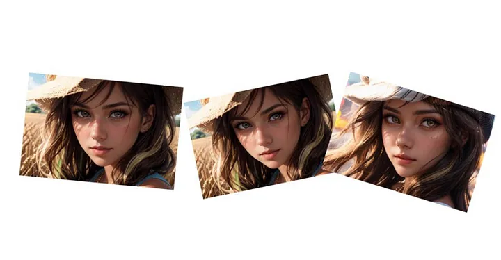
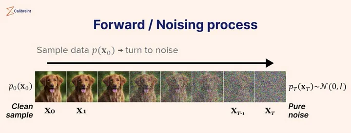
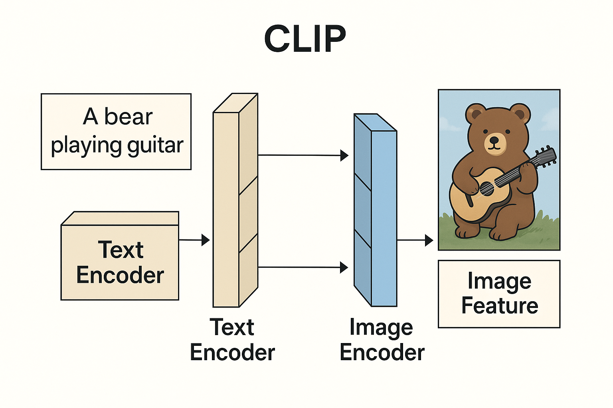
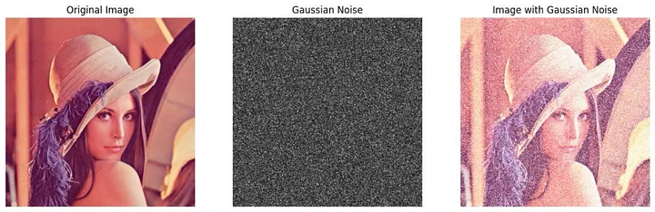
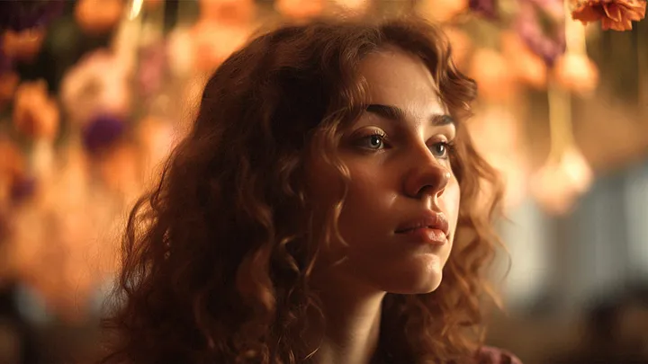
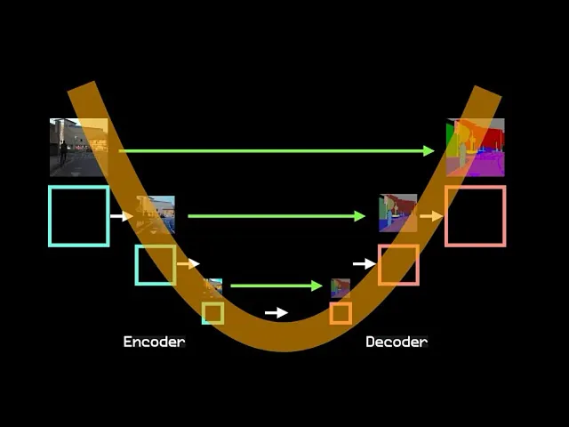

🎨 The Anatomy of MidJourney: How State-of-the-Art Diffusion Models Paint from Noise

A comprehensive deep dive into how Midjourney Transforms Noise into Stunning Art using latent diffusion

Introduction

MidJourney is among the most advanced and artistically compelling generative image models in the world. Its outputs have a distinct style – dreamlike, surreal, richly composed – and it’s become the go-to AI for millions seeking stunning visual content from nothing more than text prompts.While MidJourney isn’t open source, its architecture is widely understood. Like Stable Diffusion, it’s a state-of-the-art diffusion model built on a class of architectures known as latent diffusion models – a design that denoises abstract noise in a latent space over many steps, guided by a U-Net backbone and a joint text to image encoder.

while the exact training dataset, number of denoising steps, and model weights remain undisclosed , we know the DNA of the architecture. relies on:

• A U-Net architecture with convolutional layers (not transformers),

• CLIP or CLIP-like frozen text encoders for prompt conditioning,

• Tens of millions (likely billions) of training images scraped from the public web,

• And aesthetic tuning via human preference, reinforcement learning, and internal heuristics.

This article breaks down what we do know about how MidJourney works – layer by layer – showing how it translates language into visual structure, how it denoises images step by step, and why its aesthetic outputs feel so distinct compared to other diffusion models.

By the end, you’ll understand the core of how MidJourney turns chaos into creativity – even if the exact recipe remains locked away.

What is stable diffusion ?

At the core of MidJourney and other generative image models lies a type of architecture called a Denoising Diffusion Probabilistic Model (DDPM). Here’s how it works:

During training, machine learning engineers feed the model billions of real images, often gathered using large-scale web crawlers. The model learns by adding Gaussian noise to each image, step by step, until it’s nearly indistinguishable from static. Then, it is trained to reverse this process – predicting and gradually removing the noise until the original image is reconstructed. This teaches the model the underlying structure of images – how to build form, color, and texture from chaos.

But during inference, the model starts with nothing but random noise. There are no real images here. Instead, it applies what it learned during training to reverse the noise – using text prompts as guidance – and generate entirely new images that never existed before. The model’s weights, which encode patterns learned from billions of examples, shape this noise into something meaningful. That’s why you can type “a dragon made of glass flying over Tokyo at night,” and the model sculpts the noise into a visually coherent result.

So yes, noise happens during both training and inference – but for opposite reasons: training adds noise to learn; inference removes it to create.

🛠 Training vs ⚡ Inference:why denoising only happens only once

Before we dive further into how diffusion works, it’s important to clarify a common point of confusion:

The noising and denoising of an image process only happens during training – not during inference.

Here’s the key distinction:

⸻

🔧 Training Phase

When machine learning engineers build and optimize the model

• Goal: Teach the model to understand and generate patterns

• Process Includes:

• Forward and backward passes

• Loss calculation and gradient descent

• Architecture design (e.g., CNNs like U-Net)

• Huge datasets (often billions of images scraped from the web)

• Specialized hardware: GPUs, TPUs

• What Happens:

The model is shown clean images → noise is added over many steps → the model learns to reverse that noise by predicting it step by step.

🧠 The model is literally learning to “paint backward” from noise.

⸻

⚡ Inference Phase

When the trained model is used by users to generate outputs

• Goal: Apply what it learned to generate new content

• What Happens:

• You give the model a text prompt

• It starts from random noise and runs a forward pass through the frozen model

• Each step of denoising is now deterministic (learned during training)

• No weights are updated – it’s just applying learned functions

💡 During inference, the model is not learning anything new or doing any backpropagation. It’s not adding or removing noise from labeled images anymore – it’s just using what it already learned to generate something new from raw Gaussian noise the same used during training but no image is being denoised, it uses the patterns learned to shape the noise itself into imagery.

⸻

🧩 So What’s Really Happening in MidJourney?

When you prompt MidJourney with:

“A cathedral in the clouds, rendered in soft watercolor, with rainbow light spilling through”

…it’s not browsing images or altering real ones.

Instead, it’s:

• Starting from pure noise

• Running that noise through a series of learned denoising steps

• Mapping your prompt to abstract visual features embedded in the model’s weights

• Combining those abstract visual elements( patterns)into something entirely new

🧠 Your prompt activates the learned statistical space of concepts – not individual images. MidJourney generates new content by sampling from this space via reverse diffusion.

At the core of MidJourney and other generative image models lies a type of architecture called a Denoising Diffusion Probabilistic Model (DDPM). Here’s how it works:

During training, machine learning engineers feed the model billions of real images, gathered using large-scale web crawlers. The model learns by adding Gaussian noise to each image, step by step, until it’s nearly indistinguishable from static. Then, it is trained to reverse this process – predicting and gradually removing the noise until the original image is reconstructed. This teaches the model the underlying structure of images – how to build form, color, and texture from chaos.

But during inference, the model starts with nothing but random noise. There are no real images here. Instead, it applies what it learned during training to reverse the noise – using text prompts as guidance – and generate entirely new images that never existed before. The model’s weights, which encode patterns learned from billions of examples, shape this noise into something meaningful. That’s why you can type “a dragon made of glass flying over Tokyo at night,” and the model sculpts the noise into a visually coherent result.

So yes, noise happens during both training and inference – but for opposite reasons: training adds noise to learn; inference removes it to create.

🌀 Denoising: Reversing Entropy into Order

At the heart of diffusion models like MidJourney is a reversal of entropy.

During training, the model learns to take an image and add Gaussian noise step by step – a process that gradually destroys structure and increases entropy. The image becomes more and more chaotic, eventually approaching pure noise.

Then the model is trained to reverse that:

• From pure noise to structure

• From chaos to coherence

• From randomness to realism or artistry

This process of iterative denoising is what gives diffusion models their signature look – gradually layering in detail, composition, lighting, and texture across tens or hundreds of steps.

It’s not just image generation – it’s structured entropy reversal, step by step, guided by learned visual priors and your input prompt.

Note:State-of-the-art diffusion models perform tens to hundreds of iterative noising and denoising steps. Each step is dependent on the last, allowing the model to progressively extract a full spectrum of visual features. This staged refinement maximizes image fidelity while optimizing compute usage – enabling the model to produce high-quality results efficiently.

Understanding the U-Net Architecture in MidJourney

At the core of MidJourney’s image generation process lies the U-Net architecture, a convolutional neural network (CNN) designed especially for image-to-image tasks, such as denoising in diffusion models.

Key Features of U-Net:

Here’s a polished and complete breakdown of the U-Net architecture section for your Anatomy of MidJourney article – incorporating everything from convolution and batch normalization to channels, max pooling, and flattening:

🧠 Core Architecture: U-Net (The Backbone of MidJourney’s Diffusion Process)

While MidJourney doesn’t release its exact model weights or layer count, we know it uses a U-Net – based diffusion model, similar in spirit to Stable Diffusion. This architecture is made up of convolutional neural network (CNN) blocks designed to compress and reconstruct images – perfect for the task of turning noise into coherent visuals.

Here’s what makes up the U-Net:

⸻

🔹 1. Convolutional Layers

• Use kernels to scan across the image and extract low-level patterns (edges, textures, shapes).

• These filters learn hierarchical features – basic at first, complex as you go deeper.

Channels (Feature Maps)

• Each convolutional layer outputs a stack of channels – think of them as layers of filters:

• Early layers: detect textures, edges.

• Deeper layers: detect objects, styles, structures.

• Number of channels typically increases deeper into the U-Net (e.g., 32 → 64 → 128 → 256 → …), allowing richer representations.

⸻
 This layer is doing two things at once:

1. Extracting features (like all conv layers do)

2. Downsampling the resolution (because stride > 1)

• Number of channels typically increases deeper into the U-Net (e.g., 32 → 64 → 128 → 256 → …), allowing richer representations.

Channels are stacked layers of patterns extracted from each pixel in the image. They begin with the basics – color intensities like red, green, and blue (RGB) – and deepen into increasingly abstract representations: edges, textures, shapes, and eventually semantic structures like eyes, clouds, or architectural forms.This is crucial to understand: channels don’t just hold “information” – they hold patterns. And pattern recognition is the fundamental currency of modern AI. Whether a model is classifying is or denoising and then generating, it’s doing so by detecting, amplifying, and composing patterns across layers.

nn.Conv2d(

. in_channels=64, # How many channels are coming *in* (like RGB = 3)

. out_channels=128, # How many filters you’re applying → how many *patterns* you extract

. kernel_size=3, # Size of the window scanning over the image (e.g., 3x3)

. stride=2, # How far the window jumps each time (e.g., 2 = skip every other pixel)

. padding=1. # Adds zero borders to preserve shape if needed

)

Lets break down each part of the convolutional layer

🧩 1. Kernel Size

Sets the surface area that the filter looks at per step.

• A 3×3 kernel means: “Look at this 3×3 grid of pixels at a time.”

• It controls how much local context is used to extract patterns.

Think of it as:

📸 “What size of pixel patch am I scanning for patterns?”

⸻

🧩 2. Stride

Controls how far the kernel moves each step (i.e., how many pixels it skips).

• Stride = 1 → moves by 1 pixel = overlapping views (high spatial detail).

• Stride = 2 → skips 1 pixel per step = downsampling (reduces spatial resolution).

Think of it as:

🏃‍♂️ “How far do I move before scanning the next patch?”

⸻

🧩 3. Out Channels

Controls how many distinct feature maps (aka patterns) the conv layer learns to extract.

• If out_channels = 64, that layer will extract 64 different pattern types at each position.

• Early layers → edges, curves, textures

• Later layers → faces, eyes, objects, buildings

The number of channels gets higher and higher as the network gets deeper because it extracts more and more abstract, high-level patterns.

That’s why you’ll see:

• Early layers → 32, 64 channels (basic shapes)

• Middle layers → 128, 256 (structures, colors,regions)

• Deepest layers → 512, 1024+ (semantic categories)

Think of it as:

🎨 “How many different pattern detectors am I applying per patch?”

🧩 4. In Channels

Defines how many channels are coming in to the convolutional layer – i.e., the depth of the input.

• For RGB images: in_channels = 3 (R, G, B)

• For deeper layers: in_channels = number of output channels from the previous layer

• It tells the conv layer:

🔌 “How many stacked slices (pattern maps) do I need to process for each patch?”

Why it matters:

Each convolutional filter operates across all input channels at once and learns to combine patterns across them – not just per channel.

So if:

• in_channels = 3

• out_channels = 64

→ the model is learning 64 pattern detectors, each one looking at all 3 channels of the input.

If in_channels = 64, out_channels = 128 → you’re now looking at more abstract patterns being combined across deeper, learned features.

⸻

🧩 5. Padding

Padding controls whether or not the image edges are preserved during convolution.

• Padding = 0 → output size shrinks (because kernel can’t fit at the edges)

• Padding = “same” (or calculated) → adds zeros around the image to preserve spatial size

• Often used to prevent dimensional collapse during convolution

Why it matters:

Without padding, an image shrinks every time a kernel is applied – quickly reducing it from, say, 128×128 → 126×126 → 124×124, etc.

• Padding helps you retain spatial resolution when you need to keep patterns aligned across the same spatial grid (e.g., U-Nets).

• Also helpful when symmetry matters (e.g., skip connections in encoder – decoder designs).

⸻

🔹 2.🧠 SiLU Activations (Sigmoid Linear Unit, aka Swish)

SiLU is a smooth, non-linear activation function widely used in state-of-the-art generative models like diffusion networks. It serves the same core purpose as ReLU – introducing non-linearity and filtering out weak signals – but with smoother transitions and better gradient flow.Unlike ReLU, which hard-zeroes all negative values, SiLU softly suppresses them using a sigmoid-weighted scale. This allows even small negative inputs to contribute to the output, resulting in a continuous and expressive activation pattern across layers.It doesn’t make negatives positive (like absolute value would).

📐 Mathematical Form:

\text{SiLU}(x) = x \cdot \text{sigmoid}(x)

So:

• If x < 0, the sigmoid(x) is small → x is downscaled, not discarded

• If x > 0, sigmoid(x) is near 1 → x is mostly passed through

SiLU is a deterministic non-linear activation function that does the same job ReLU does – only without hard-canceling gradients under zero. It suppresses them softly and projects a pattern-based continuation into the next layer. This smooth transition helps deep networks learn rich, abstract patterns while preserving signal detail across layers – a core requirement in architectures like diffusion U-Nets.

🔍 Why This Matters

SiLU enables:

• Smoother signal propagation

• Stronger gradient flow

• Fewer “dead neurons”

• Rich feature learning – especially crucial for diffusion models, where fine signal continuity is essential during denoising

No randomness. Just a simple function.

⸻

🔹 3. Group Normalization

Group Normalization – a normalization technique used in modern diffusion models instead of BatchNorm. It normalizes across groups of channels in each individual image, making it more stable during training and effective for small batch sizes – which is common in generative models like MidJourney and Stable Diffusion.

Group Normalization still standardizes the features, just like BatchNorm – the difference is what it standardizes across.

GroupNorm: Normalize across groups of channels within each individual image

Batch norm is NOT used in State-of-the-Art diffusion models, group norm is

⸻

✅ What Both BatchNorm and GroupNorm Do:

They normalize the input features so that:

• Mean ≈ 0

• Standard deviation ≈ 1

This stabilizes training, accelerates convergence, and prevents exploding or vanishing gradients.

Normalizes the output of feature maps within each individual image by splitting channels into smaller groups (e.g., 32 groups).
• Unlike BatchNorm, it doesn’t rely on batch statistics, which makes it far more stable when batch sizes are small or variable – a crucial property for diffusion models.
• This normalization helps the model maintain consistent gradients and stable activations across noisy inputs during the denoising process.
• Used in all modern diffusion architectures like Stable Diffusion, GLIDE, Imagen, and likely MidJourney.
⸻

🔹 🔍 Understanding Attention in Diffusion Models (U-Net style)

 What Is Attention Doing in a Diffusion Model?

In image generation, attention helps the model:

• Focus on different parts of the image when making predictions

• Relate different spatial regions to one another

• Align image regions to text prompts (in cross-attention, for example)

⸻

🧱  Main Types of Attention in Diffusion Models

Self-Attention
• Compares every patch of the image with every other patch
• Learns global relationships between pixels (e.g., the head is related to the body)
• Often inserted at the bottleneck of the U-Net, where the spatial size is smallest – making the computation tractable
🔸 Used for:

Capturing long-range dependencies
• Letting the model reason globally, not just locally via convs
⸻

2. Cross-Attention

• Used in text-to-image models (e.g., Stable Diffusion, MidJourney)

• Attention flows from image → to text: each pixel region attends to semantic features in the text embedding (e.g., from CLIP)

🔸 Used for:

Aligning regions of the image to words in the prompt
• Example: “dragon” → tail, wings, horns, texture

🔹 5.Upsampling + Skip Connections

• On the decoder side, the model upsamples the spatial resolution (e.g., 64×64 → 128×128).

• Skip connections bring in feature maps from earlier layers at the same resolution, giving the model:

• Precise spatial details lost during downsampling

• Contextual depth from earlier abstraction layers

⸻

🔹 6.Final Output Layers

• Final convolutional layers convert the decoded feature maps into an image prediction (RGB pixels).

• During training, this is compared to the original image for loss computation.

• During inference, it’s one of many iterative denoising steps toward a final image.

Note:

🔹 Flattening Layers

• Sometimes used to convert 3D feature maps (e.g., 64×64×128) into 1D vectors for passing into fully connected layers.

• May appear in hybrid or older designs, though many modern U-Nets are fully convolutional and skip this step.

Are NOT used in stable diffusion models

🧠 Where It’s Common:

• In early CNNs for classification (e.g., LeNet, AlexNet, VGG)

• Where the goal is to map feature maps into class logits

❌ Where It’s Rare or Unnecessary:

• In modern generative models like Stable Diffusion and MidJourney, which are fully convolutional.

• These use U-Net architectures, which don’t flatten – they preserve spatial structure throughout the encoder and decoder for pixel-accurate generation.

🔧 Why Flattening ≠ Useful in Generation:

• Flattening destroys spatial resolution.

• For generation (not classification), you want to preserve structure, not collapse it.

✅ So yes – you’re right: Flattening is outdated for image generation models like Stable Diffusion or MidJourney.

It can be omitted in your breakdown unless you’re referencing legacy hybrid designs.

🎯 What is CLIP:

What Is CLIP? (Contrastive Language – Image Pretraining)

CLIP is the text encoder that powers models like MidJourney, DALL·E, and Stable Diffusion. It was created by OpenAI to help neural networks understand how text and images relate.

🎯 What CLIP Does:

CLIP learns to embed both images and text prompts into the same vector space – meaning both a sentence and an image can be represented as points in the same high-dimensional world.

📐 CLIP is trained using contrastive loss, which:

• Pulls matching image-text pairs closer in the embedding space

• Pushes apart mismatched pairs

This forces the model to learn semantic alignment – understanding that “a red apple on a table” refers to visual patterns common in apple images.

CLIP learns to embed (i.e., convert) both images and text prompts into the same vector space – meaning both a sentence and an image can be represented as points in the same high-dimensional world.

Once trained, this allows a model to:

• Compare how closely a sentence matches an image

• Generate or retrieve images that are semantically similar to a text prompt

While models like MidJourney generate images from pure noise, the denoising process is steered by CLIP – which maps your text prompt into a semantic space that clusters around billions of images seen during training. So in effect, the model samples from an abstract, high-dimensional distribution of image concepts aligned with your prompt – not from pixels, but from learned associations. This is why it can create coherent and aesthetically tuned images that ‘match’ your input prompt.

🧱 Core Building Blocks of Diffusion U-Net Models (like MidJourney)

Just like how transformers are mostly made of repeated foundational blocks – e.g., Multi-Head Attention, LayerNorm,dense layers, residuals – diffusion models, especially U-Net – based architectures, are built on repeated CNN blocks, with only one major unique function:

⸻

✅ Fundamental CNN Components (Repeated Many Times):

These make up 90 – 95% of the architecture in models like MidJourney, Stable Diffusion, DALL·E 2, etc.:

• Convolutional Layers

• Extract localized visual patterns (edges, textures, shapes).

• Controlled by kernels, strides, and channels.

• ReLU Activations

• Adds non-linearity; allows deep networks to learn complex mappings.

• Batch Normalization

• Normalizes each batch to stabilize and accelerate training.

• Mean = 0, standard deviation = 1.

• Max Pooling

• Downsamples the feature map by taking the strongest signal in each region.

•

• Used at bottlenecks or when transitioning to fully connected parts of the network.

• Skip (Residual) Connections

• Merge encoder and decoder features for better reconstruction.

• Prevent loss of fine-grained detail.

These blocks are stacked deeply, sometimes 30 – 70 layers deep learning on resolution and training goals.this is why SOTA deep learning models are often 90 + layers deep.

⸻

🌫️ The Only Truly Unique Function of Diffusion Models:

➤ Gaussian Noising Along the Markov Chain

This is what makes diffusion models diffusion models:

• During training:

• Clean images are gradually corrupted with Gaussian noise over T time steps (a forward Markov chain).

• The model learns to reverse this corruption – denoising step-by-step.

• During inference:

• The model starts with pure noise and reverses the chain using the learned denoising function.

• Over T steps, it constructs a clean, high-quality image from scratch – conditioned on the text prompt.

💡 So unlike DeepSeek or GPT-style transformers – which have attention heads, routing gates, and MoE modules – diffusion models have no “standout” block other than this noise-to-image probabilistic inversion process.

Loss Function & Optimization (Training-Time Only)

While MidJourney’s full training process isn’t publicly detailed, its methods are not truly proprietary – they follow known deep learning techniques. If MidJourney had discovered a fundamentally superior optimization method beyond backpropagation and reinforcement learning, it would likely be public by now. In cutting-edge AI, companies race to show innovation.

Instead, what makes MidJourney special is likely not architectural novelty, but rather scale, precision, and aesthetic tuning:

Loss Function

Like other diffusion models, MidJourney likely uses denoising score matching as its core loss, where the model predicts noise added to an image during training.
• This is a standard mean squared error (MSE) between actual and predicted noise:
L = \mathbb{E}{x, \epsilon, t} \left[ \| \epsilon – \epsilon\theta(x_t, t, c) \|^2 \right]
In diffusion models like MidJourney, the loss function primarily trains the model to predict and remove noise progressively at each timestep during the denoising process.
• At each denoising step, the model tries to estimate the noise that was added to the latent representation (or image),

• The noise loss measures how well the model’s prediction of that noise matches the actual noise added,

• By minimizing this loss during training, the model learns to reverse the noising process, transforming random noise into a coherent image step-by-step,

• This leads to clearer, sharper, and more accurate final outputs because the model can better reconstruct meaningful patterns instead of residual noise,

• The better the model becomes at noise prediction/removal, the better its latent embeddings capture visual concepts, allowing for richer, more detailed images.

• The goal: make the model better at removing noise at every timestep – allowing the final output to emerge clearly from pure static, which results in better pattern embeddings and thus better images.
Optimization

MidJourney almost certainly uses backpropagation with Adam or AdamW optimizer.
• What likely sets it apart is:
• A larger-scale training dataset (billions of image-text pairs)
• Massive compute budget
• Possibly finely-tuned prompt conditioning, using CLIP or a similar embedding model
• Highly curated training images with an emphasis on aesthetic patterns
🔹 Reinforcement Learning & Aesthetic Optimization

MidJourney is known for the distinctive beauty and style of its outputs. This likely doesn’t come purely from denoising loss – it’s almost certainly refined using:

ML engineers perform Human Preference Reinforcement
MidJourney gathers implicit feedback from its user base (e.g., upvotes, usage frequency, etc.)
• It likely applies Reinforcement Learning from Human Feedback (RLHF), similar to what OpenAI does with ChatGPT – except here the reward signal may be tied to image quality, artistic preference, or prompt alignment.
Unlike text-based RLHF, the reward here isn’t about factual accuracy – it’s about visual coherence, style,
Unlike text-based RLHF, the reward here isn’t about factual accuracy – it’s about visual coherence, style, and emotional impact. MidJourney’s outputs feel more artistic than competitors’ because it’s likely trained to prioritize artistic structure and composition above realism or strict prompt literalism.This works by makiing the model focus prioritize patterns in their weights that are most conducive to beauty and polished art.

🎨 MidJourney Generation Pipeline: From Prompt to Photorealism ( Inference)

Note: this is NOT drawn to scale, actual state of the art deep learning models are a series of foundation blocks repeated dozens of times over as stated earlier. This exists as visual conception only.

Though MidJourney’s precise weights and training data are not open source , its underlying architecture and workflow are based on denoising diffusion models – especially U-Net – based architectures enhanced with prompt conditioning and cross-attention mechanisms.

Here’s a complete stage-by-stage overview of how your text prompt is transformed into a high-fidelity image:

⸻

🔹 Stage 1: Input Prompt → Text Embedding

• You provide a prompt (e.g., “a cyberpunk dragon flying over Tokyo”).

• MidJourney encodes this prompt using a powerful language encoder – likely CLIP’s text encoder or a similar transformer model.

• The output is a dense vector embedding that captures the semantic and stylistic meaning of your prompt (not just word-level meaning, but artistic tone, color, mood, etc.).

• This embedding will guide every stage of image construction.

⸻

🔹 Stage 2: Gaussian Noise Initialization

• During inference (generation), MidJourney starts with pure random Gaussian noise – essentially visual static.

• The model will now iteratively refine this noise to form a coherent image conditioned on the prompt embedding.

⸻

🔹 Stage 3: Conditioned Denoising Loop (The Core Diffusion Process)

MidJourney runs this loop for tens to hundreds of denoising steps, gradually sculpting the noise into an image:

🔸 Step 1: Downsampling Path (Encoder)

• The noisy image is passed through several convolutional layers in the encoder path of the U-Net.

• With each layer:

• strided convolution reduces spatial resolution.

• Channel depth increases – from 32 → 64 → 128 → … → 1024. This happens naturally as the model extracts more features from the image

• ReLU activations and batch normalization keep features expressive and stable.

• Prompt conditioning may occur via cross-attention (e.g., the model pays attention to prompt-relevant features).

• This compresses the noisy image into a dense latent representation capturing high-level structure and composition.

⸻

🔸 Step 2: Bottleneck (Compressed Representation)

• The deepest part of the U-Net: where spatial resolution is lowest and semantic abstraction is highest.

• Here, the model holds a compact understanding of the future image’s shape, lighting, perspective, etc.

• This is where global coherence forms (e.g., aligning the dragon, cityscape, and mood from the prompt).

⸻

🔸 Step 3: Upsampling Path (Decoder with Skip Connections)

• The model now upsamples the latent features back into an image – step by step, increasing resolution:

• 16×16 → 32×32 → 64×64 → 128×128 → 256×256 → 512×512

• At each step:

1. The decoder upsamples the latent tensor.

2. It then concatenates this with the matching resolution feature map from the encoder path (skip connections).

3. These merged features are passed through convolutional layers again.

💡 Why skip connections matter:

They allow the model to combine:

• High-level semantic features (from deep layers)

• With low-level spatial precision (from early layers)

This blending is crucial for generating sharp, coherent images that match the prompt.

⸻

🔹 Stage 4: Final Image Output

• The last convolutional layers map the final high-res tensor into a 3-channel RGB image.

• This image is your final output, completely generated from noise, but precisely shaped by:

• Billions of image-text pairs seen in training which are stored in the vector space( its neurons )

• The patterns captured in its CNN layers

• The meaning embedded in your prompt

Mini version

Your Prompt →

CLIP Text Encoder →

Gaussian Conditioned Noise →

U-Net (Downsample( max pooling layers do this) → Bottleneck( this is where the fundamental blacks like convokutiinal layers,SELU, group Normalization, residual layers come into play and are repeated dozens of times again and again in a row )→ Upsample + Skip Connections) →
Denoised Output →

Final Image

Notes:

The skip connections allow detailed features from early layers to influence later reconstruction – crucial for preserving structure.it concatinates patterns from earlier layers

• The CLIP embedding conditions each denoising step, guiding the model toward semantic alignment with the prompt.

• The model starts from noise at inference time, not from a corrupted image – this is reverse entropy in action.

• Encoder compresses the image into a latent representation.

• Decoder reconstructs the image from that.

• The skip connections let the decoder “peek” at earlier high-resolution features to recover:

• Edges

• Spatial layout

• Texture

• Fine detail lost during downsampling

This is Second in the flagship “Anatomy of AI” series
