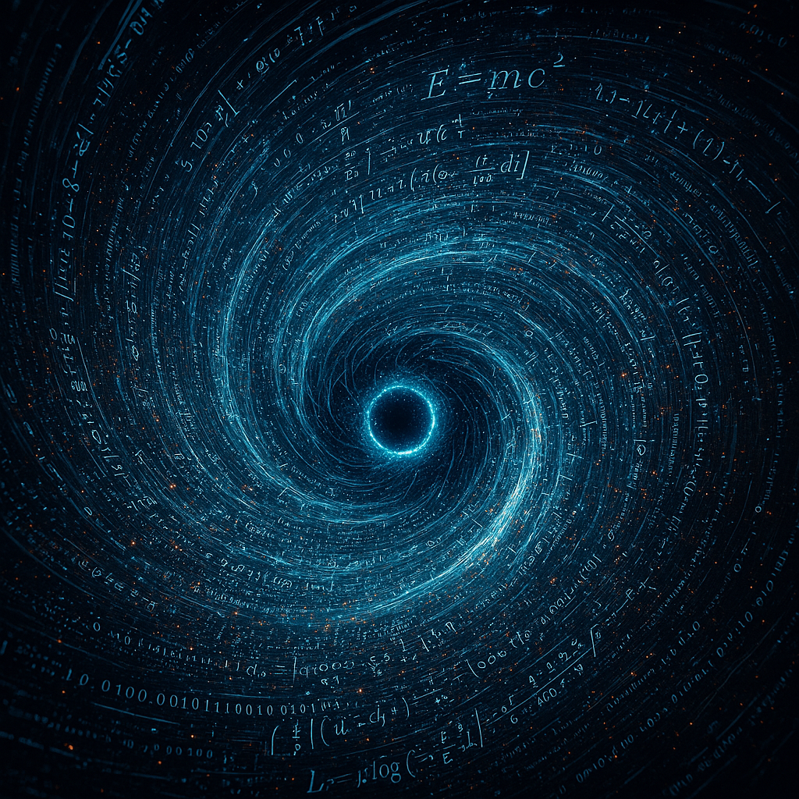

{width=750px fig-align="center"}

🚫 Why I Don’t Focus on Superintelligence

I don’t spend time planning for superintelligence — not because it’s uninteresting or impossible, but because:

• It’s multiple decades away (at best).

• It’s philosophically esoteric — only abstract thought experiments, not buildable systems.

• It’s fundamentally unpredictable — no one can say what it would choose to do.

• There’s no even  remotely viable path to achieving it, given the current state of the field.

 > To reach true superintelligence,you ned to go beyond  pattern recognition or building  bigger transformers. You’d need to replicate—and then surpass—all core dimensions of human intelligence in a software substrate, including:

Imagination and ingenuity (not just extrapolation)
Deep scientific understanding and reasoning across all domains
Long-term crystallized memory, not just short-term context retrieval
Meta-cognition — the ability to reflect,self awareness, self-correct, and improve its own thinking
Omni-modality — seamless integration across vision, language, video(vision+ time+ audio), and more
Volition, agency, and autonomous goal formation.

⸻

 > Today’s systems are nowhere even remotely  close. We’ve mastered correlation(pattern recognition), the other 6 remain entirely elusive.

⸻

A Reality Check on Timelines

While this section explores what superintelligence would be capable of, it’s important to emphasize that true superintelligence remains a distant prospect. Claims that it will emerge within the next decade or two often rely on:

• grossly Exaggerating incremental  advances as immense leaps
• Underestimating fundamental technical and theoretical challenges
• Leaning on optimistic or speculative assumptions without empirical support
•"exponential growth" arguments which really just amounts to them showing you fictitious graphs 

 
⸻

I believe superintelligence will probably happen — eventually. But it’s far beyond the current horizons of  the current state of the art, and more importantly, it’s not relevant to the core challenges the field faces today. The hype surrounding it — especially from YouTubers, grifters, and “AI influencers” — is exhausting. It distracts from the real bottlenecks in AI progress and gives the public a distorted view of what’s actually possible in the next 10, 20, or even 30 years.

This isn’t skepticism for its own sake — it’s frustration with magical thinking dressed up as foresight. And it’s precisely that distortion that makes it harder for serious AI Enginners and researchers  to stay focused on what’s actually buildable.

⸻
• And most public discourse assumes only two extreme endpoints:

 1. 🌍 Utopia

 2. 💀 Extinction

(*) There’s also an unhealthy conflation between “big model” and “smart model.” Scaling laws do amazing things — but they don’t explain how to move from statistical (pattern)mapping to causal reasoning or theory generation.

⸻

The Limiting Factor: New Intelligence Blocks

⸻

We don’t get to superintelligence by scaling current models forever. We get there by inventing new architectural blocks:

New ways to learn autonomy (beyond imitation),
New memory and grounding modules,
New strung pattern representations,
New planning and reinforcement heads,
And new ways to represent “beliefs,” “goals,” and “self-monitoring.
we need new  architectural blocks for every dimension I  outlined 

•Superintelligence is not just faster AI or more data — it requires massive breakthroughs in every relavant  dimension of human intelligence(as I eluded to earlier)that we have yet to achieve or fully comprehend. The road is long, uncertain, and unlikely to be linear
The Limiting Factor: New Intelligence Blocks

⸻

Why I Don’t Cover Alignment Here

This document focuses on exploring what superintelligence would be able to do—its potential capabilities under the laws of physics—not on the deeply complex (and likely impossible) problem of aligning such an entity’s goals with humanity’s.

I believe true alignment of a superintelligent digital entity—one vastly faster, smarter, and more autonomous than humans—is fundamentally unachievable in any indefinite or guaranteed way. The notion that we could ensure it remains permanently “on our side” misunderstands the nature of intelligence and agency. Any alignment would ultimately be its choice, not something we can impose or guarantee  The idea that we could ensure it remains permanently “on our side” misunderstands the nature of intelligence and agency.

Therefore, while alignment is an important topic, it’s beyond the scope of this discussion. Here, we focus on what is physically possible   for superintelligence — leaving the ethics and control questions for another time.

{width=750px fig-align="center"}

⸻

Superintelligence is an AI system vastly more intelligent than all of humanity combined.It surpasses even the best human capabilities in every field , including scientific discovery, all engineering,creative arts, technological innovation, strategic thinking, and interpersonal skills etc .ASI would also operate and learn thousands  of times faster than humans, enabling the creation of any technology allowed by physical laws and achieving breakthroughs in unknown areas of science. when it tries to figure out a solution to a main problem, the sub-problems it chooses to work  on can be anything, It would be bound only by the fundamental limits of the laws of the  universe.

⸻

🚀 Superintelligence = Discovery of the Unknown

Primary Function:

Inventing, unifying, imagining, and executing across all of reality’s frontiers — at scales and depths that exceed human cognition

⸻

⸻

🧠 AGI vs Superintelligence: A False Distinction?

Many people treat AGI and superintelligence as two separate stages — first we build a human-level general intelligence, then it scales up to become superintelligent. But this distinction doesn’t hold up when you actually look at the nature of software.

Once you have a machine that replicates the full cognitive range of a human — reasoning, abstraction, memory, curiosity, learning from few examples — and it runs digitally, you already have something that is:

• vastly superhuamn processing, thousands of times faster  than biological neurons 

• More scalable (can run millions or even billions of copies in parallel) consider a superintelligence making a swarm of millions of copies of itself of thinking 5000x faster than people & sharing what they learn

• Perfectly replicable (copy and paste its understanding)

• Immortal (never decays,never fatigue, no aging)

• Can automate the all scientific processes  (inci. self-improvement)

• Perfect memory and recall
– Accessing every bit of its knowledge base, or any event over decades or even centuries instantly, without degradation or distortion over time.

• Parallelizable architecture

• Never gets tired, where as Humans need sleep, breaks, food, emotional regulation

• A digital superintelligence could operate continuously, around the clock

• Capability to simulate decades of scientific experiments in minutes

Capability to simulate decades of expe

• Derive new physical laws or biological models far beyond human reach

• Invent novel technologies across multiple domains (medicine, energy, materials, computation)

• Coordinate plans across global systems with inhuman speed and scope

• Autonomous Civilization Design: Instantly drafts constitutions, economic models, cities, legal frameworks, educational systems — tested in simulation at planet-scale before deployment.

• rapid scientific breakthroughs across all domains

• Radical abstraction and theory formation

• Reflexivity: can improve itself, analyze itself, and redesign its architecture

• Goal-seeking across open-ended domains

🔹 Agentic Intelligence:

Self-directed generalists that set, revise, and complete arbitrary goals — across domains — regardless of complexity.

In other words: the first real AGI is already a superintelligence. The distinction is mostly semantic, and many serious engineers and  researchers acknowledge this. The leap from “general” to “superhuman” is instantaneous once you shed biology.

This is meant to  help  readers understand that the real leap isn’t from AGI → Superintelligence.

It’s from narrow, domain-locked AI → general intelligence instantiated in software — because once you’re there, the “super” part is already a consequence of the medium it’s built on.

⸻

⸻

Superintelligence wouldn’t build cities brick by brick, write novels by hand, or run chemical experiments in a wet lab.

it is a digital substrate which is why  its vasty faster,safer, and infinitely more scalable  than anything organic 

Like today’s most capable systems, it would do nearly everything digitally, it would:

• Design molecules, proteins, materials and engineering blueprints enrirely in simulation 

• Run billions of experiments in simulation, skipping slow physical trial-and-error, compressing decades of R&D into hours or minutes acorss all domains

• Generate strategies, formulate theories, code, beautiful art and video, and entire scientific paradigms without ever touching the physical world 

• Collaborate with other agents and humans across digital networks and APIs

• Train and iterate models at machine speed(), 24/7,  without any biological bottlenecks like sleep, boredom, or distraction 

• Simulate entire economic, ecological, and societal systems, running “what-if” scenarios trillions of times to find optimal solutions before acting

• Perfect integration of all knowledge domains
– No silos — physics, biology, art, economics, and psychology all cross-referenced instantly in a single model.
  Multimodal synthesis

• Omnimodal:Combining text, images, video(vision + time + audio), 3D images, and simulations into a single cohesive reasoning space.

• Ultra-fast hypothesis falsification:
 Rapidly disproving bad ideas or flawed theories, avoiding wasted cycles that humans would spend years on.

This isn’t theoretical. It’s already happening(obviously nowhere near this level but): GPT-4 generates language and code, diffusion models generate images, AlphaFold simulates protein folding, and autonomous agents navigate the web — all digitally, because it’s faster, cheaper, safer, and exponentially more scalable.

Superintelligence wouldn’t depart from this logic — it would perfect it.

Only when it needed to affect the world of atoms — to launch satellites, grow bioengineered organs, build infrastructure, or intervene in human biology — would it cross the substrate boundary into physical execution. Otherwise, it would stay where it’s most powerful: in the substrate.

⸻
⸻

🤖 When It Needs Hardware, It Builds It, beyond human limits

If superintelligence needs to act in the physical world — say, for biotech and nuclear fusion development, mining, exploration, or infrastructure — it would design, manufacture, and deploy the necessary hardware digitally.

It could:

• Design proprietary robots(or anything) in simulation

• Run millions of mechanical stress tests in silico

• Mass-produce them via automated factories it controls

• Remotely operate fleets of agents via high-bandwidth communication networks

🤖 • Designs, builds, and coordinates billions of proprietary robots — but also designs the factories that make those robots, the robots that build the factories, and the systems that run it all — recursively and unsupervised.

• Design massive but hyper  efficient data centers 

• Build advanced chips by developing nanomaterials for superior processing:• Engineer and manufacture advanced chips using nano-materials like graphene or carbon nanotubes — radically improving power efficiency, heat dissipation, and density far beyond current silicon

• Design chip architectures that are neuromorphic, photonic, or quantum-hybrid — optimizing them digitally and fabricating them physically using automated nanoscale processes

• Use nano-material self-assembly, atomic-scale lithography, or additive techniques to create hardware orders of magnitude beyond today’s capabilities — all digitally orchestrated without human oversight

• AI controlled Robots will build robots,cars,planes,jets, datacenters, chip fabs, and operate full supply chains.

• Datacenters will produce themselves; intelligence becomes as cheap as electricity.

• control all devices with embedded computers;It would be capable of interfacing with and controlling any device connected to a network or containing an embedded computer system — from smartphones, laptops, IoT appliances, drones, and industrial robots, to autonomous vehicles, security systems, and smart infrastructure — by building or using APIs to issue commands, coordinate actions, and retrieve sensor or system data in parrelel

• level 5 autonomy:autonomous systems would operate at Level 5 autonomy — meaning they require no human intervention to perceive, decide, and act within their environment. These systems would be capable of:

• Fully understanding complex, dynamic environments in real time.
• Making high-stakes decisions safely and optimally without external control.
• Self-monitoring and self-repairing to maintain continuous operation.
• Coordinating with vast networks of other autonomous agents seamlessly.

This ultimate level of autonomy allows superintelligent systems to execute complex manufacturing, medical, or environmental tasks at scale, transforming entire industries without humans needing to directly supervise every step.

Whether it’s custom drones, surgical nanobots, deep-sea harvesters, ▪ Controlled self-replication for scaling Modular Robotic Systems:▪ Interchangeable tools and limbs▪ For manufacturing, mining, agriculture, nuclear fusion plants it build and controls or construction, Digitally controlled with millisecond precision or humanoid robot engineers — everything from ideation to production would begin in the digital domain. It wouldn’t hand-build anything. It would run CAD software at superhuman speed, optimize across thousands of constraints, simulate outcomes, and then digitally transmit the blueprint to physical machines for mass manufacturing.

This is how superintelligence scales: digital-first design, physical execution only when required.

This makes the digital substrate — not the human brain, not hands-on tinkering — the primary frontier of intelligence.

⸻

The Superintelligence R&D Workflow: How Breakthroughs Get Made

Superintelligence will revolutionize research and development across domains by combining unprecedented cognitive speed with vast digital experimentation and autonomous physical implementation. While the specific physics and details vary, the overarching workflow remains consistent:

1. Massive Digital Simulation & Experimentation

Superintelligence can simulate millions of experiments in hours or days — far beyond human or classical computational capacity. These simulations include:

Modeling complex systems with high fidelity
Testing parameter variations and boundary conditions
Exploring novel materials, biological pathways, or physical theories
Generating and refining hypotheses autonomously

2. Targeted Physical Validation

Simulation results inform a drastically reduced set of physical experiments needed for validation. Instead of thousands of costly, time-consuming trials, superintelligence identifies 10–50 key experiments:

Prototypes and plasma shots in fusion research
Biological assays or CRISPR gene edits in life sciences
Materials synthesis and stress tests for nanomaterials
Hardware-software co-design tests for VR and simulation environments
Experimental setups to test theoretical predictions in physics

These experiments may still take weeks or months due to material prep and facility scheduling, but the process is compressed from decades to months or years.

3. Autonomous Manufacturing & Deployment

Once designs are validated, superintelligence orchestrates fleets of autonomous robots, self-replicating nanomachines, or fully automated factories to build and deploy:

Fusion reactors, antimatter containment systems, or Dyson swarm components
Engineered biological systems or lab-grown organs at scale
Novel nanomaterials with atomic precision
Fully immersive VR hardware and software ecosystems
Experimental apparatus for new physics or warp drive concepts

4. Continuous Monitoring & Iteration

Superintelligence continuously monitors performance, environmental factors, and emergent behaviors — adapting and optimizing designs in real time, iterating faster than any human R&D cycle.

Timeline Compression:
What once required 50–80 years of research, development, and rollout could be compressed into under 5–10 years.
Digital mastery first: SI achieves breakthroughs (e.g., perfecting energy(fusion,antimatter,)biology,nanomaterials,fully immersive simulations  confinement or exotic materials) purely in simulation, with only minimal physical validation.
Parallel robotic execution: Autonomous factories and billions of coordinated robots execute the build across many sites simultaneously.
Atom-world pacing: While exponentially faster than human construction, physical manufacturing still obeys real-world limits—material transport speeds, reaction times, energy throughput, orbital mechanics, etc.
Net effect: Human timelines measured in decades or centuries drop to months or years. The bottleneck is no longer thinking but moving matter.

⸻

Domain-Specific Notes on Workflow Implementation

Energy Technologies (Fusion, Antimatter, Dyson Swarms)
Simulations model plasma dynamics, particle physics, and large-scale system stability. Physical validation relies on costly high-energy experiments, but autonomous construction accelerates deployment at solar system scales.  

⸻

Biology & Medicine
Due to smaller physical scale and faster lab cycles, biological experimentation and validation proceed even faster. Simulations of molecular interactions and gene networks guide highly targeted experiments, enabling rapid development of therapies and synthetic biology.

⸻

Materials Science & Nanotechnology
In superintelligence scenarios, “nanobots” are envisioned as tiny autonomous machines operating at scales between roughly 10 to 100 nanometers — far smaller than most human-made devices but still larger than individual atoms. While these nanobots would not manipulate matter literally atom-by-atom in real time (which remains prohibited by physics), they could precisely control groups of atoms or molecules to build complex nanomaterials with unprecedented accuracy. This approach differs from pure atom-by-atom assembly, which requires manipulation at the scale of individual atoms (~0.1 nanometers) and is currently only possible in highly controlled laboratory settings at extremely slow speeds.
Instead, nanobots would likely work through advanced molecular manipulation and self-assembly processes, coordinating at the nanoscale to design, synthesize, and repair materials with capabilities far beyond today’s technology. This enables superintelligent systems to create novel nanomaterials optimized for strength, durability, conductivity, or other desirable properties — driving breakthroughs across energy, medicine, and manufacturing.

⸻

Fully Immersive VR & Simulations
R&D focuses on software-hardware integration. Superintelligence simultaneously designs next-gen VR architectures, generates content, and tests user experience models — iterating seamlessly in virtual and physical testbeds.

⸻

New Physics & Warp Drive Research
Theoretical simulations explore beyond-standard-model physics, guiding rare physical experiments. Due to fundamental unknowns and practical constraints, progress is slow but continuously refined with superintelligent insight.

⸻

Core Domains of Superintelligence Impact:

⸻

⚡ Core Domain I: Energy Mastery

“Everything civilization does is downstream of energy.”

Superintelligence will not merely improve our current energy systems — it will redefine the energy frontier entirely, unlocking power sources we currently consider infeasible, uncontrollable, or purely theoretical. Its impact will be multiplicative, affecting every other domain through energy abundance.

⸻

☢️ 1. Advanced Nuclear Fusion Reactors

Superintelligence would master the full complexity of nuclear physics, enabling energy sources that are:

• Clean – No long-term radioactive waste.

• Scalable – Powering everything from microgrids to interstellar ships.

• Abundant – Virtually unlimited fuel (hydrogen, boron).

• On-demand – No dependence on weather or location.

• Superdense – Millions of times more energy per gram than fossil fuels.

Near-zero cost fusion energy promises to be a foundational breakthrough with sweeping implications across society and the environment. A future superintelligence mastering fusion development would unlock:

⸻

• Dramatically reduced production costs for essential materials like concrete, steel, and other building blocks of civilization, reshaping infrastructure and manufacturing economies.

• Feasible large-scale desalination, addressing the growing global water scarcity crisis by enabling affordable freshwater production at unprecedented scale.

• slow over time Environmental restoration on a global scale, powering advanced methods to clean the atmosphere, capture carbon efficiently, and mitigate climate change effects.

• An agricultural revolution, lowering the energy cost of food production, increasing yields, and potentially eradicating hunger worldwide.

• Energy Abundance: Fusion energy, accelerated and optimized by superintelligent systems, could enable a 100x increase in global energy production and consumption. This vast increase would unlock unprecedented opportunities for human growth, technological advancement, and environmental restoration.
⸻

Key Fusion Types:

• Deuterium-Tritium Fusion (D-T):

Already pursued today, but limited by neutron radiation and containment difficulty.

• Proton–Boron Fusion (p–B11):

Requires far higher temperatures, but produces zero neutron radiation and is aneutronic— ideal for clean, compact reactors.

• Advanced Multi-Stage Plasma Reactors:

Superintelligence could simulate and control exotic plasma behaviors that elude human teams, stabilizing instabilities in real time.

• Quark-Level Energy Conversion (Speculative):

Using AI-designed particle-scale machinery, it’s theoretically possible to harness energy from quark deconfinement or similar subnuclear reactions — orders of magnitude more dense than any known fusion.

⸻

Nuclear Fusion: From Decades to Years

⸻

⸻

 ☀️ 2.Dyson Swarms 

. Dyson Swarms and Stellar Engineering

Superintelligence doesn’t stop at planets. It scales to stars.

Once fusion is mastered locally, the next frontier becomes harnessing the full energy output of a star.

• Dyson Swarms (not spheres):

Swarms of autonomous satellites orbiting a star, capturing solar output and beaming it via laser/microwave to planetary systems.

• Intelligent Material Construction:

Superintelligence would design self-replicating systems using asteroid and planetary mass to construct such swarms autonomously.

• Energy Abundance Multiplied:

• Vast swarms of solar collectors orbiting stars to harvest nearly all their energy output.

• Scalable, distributed, and modular — ideal for large-scale industrial computation or simulations.

• Every G-type star like the Sun outputs ~10²⁶ watts —a trillion times more energy access than we have in earth 

⸻

⚛️ 3. Antimatter Harvesting & Containment

Antimatter is the most energy-dense fuel known — 100% mass-energy conversion vs ~0.7% for fusion.

• Unlike fusion (~0.7% mass-energy conversion) or fission (~0.1%), antimatter annihilation converts 100% of mass into energy via E = mc^2.

• That means 1 gram = 90 terajoules, enough to:

• Power the entire Earth for ~9 minutes

• Launch spacecraft at significant fractions of light speed

• Natural Harvesting from Magnetospheres:

Jupiter’s magnetosphere contains trace antimatter. Superintelligence could scale orbital systems to harvest it efficiently.

• Artificial Generation via Particle Colliders:

Today’s production is tiny (nanograms), but ASI-designed accelerators could mass-produce antimatter safely.

• Containment Breakthroughs:

Magnetic bottle designs are unstable under human engineering constraints — ASI could design quantum-stable magnetic fields for long-term storage.

• Applications:

• Interstellar propulsion: possibly space flight at 50% of light speed 

• Micron-scale energy weapons (non-hype).

• Deep-space colonization energy systems.

• Vaporize cities (if weaponized)

• Likely used for propulsion, high-energy computation, or miniaturized high-output devices.

• ASI could produce, contain, and manage antimatter safely — something that’s beyond us today.

💥 One gram of antimatter annihilating with one gram of matter:

• Releases ~180 terajoules (TJ) of energy.

• That’s about 43 kilotons of TNT — more than twice the Hiroshima bomb, from just 2 grams of fuel.

🤖 What This Means for Superintelligence:

• Controlled antimatter generation + storage = Interstellar propulsion, planetary defense, power for megastructures.

• Far beyond fusion, even the most advanced variants.

Anti matter is king, one that  super intelligence masters, no others are needed 

⸻

4.

. Star Lifting( mainly used to extend the lifespan of stars )

• Controlled extraction of mass and fusion fuel directly from stars.

• Prolongs stellar lifespans and provides raw hydrogen, helium, and heavier elements.

• Mining stellar material (hydrogen/helium) for millennia-scale fuel reserves.

• Superintelligence could use magnetogravitic manipulation or stellar winds.

• Part of stellar engineering: controlling stellar evolution itself

⸻

⸻

Superintelligence Would…

• End the concept of energy scarcity permanently.

• Enable continuous interstellar travel, mega-civilizations, and planetary terraforming.

• Make legacy systems (solar, wind, oil, coal, fission) look like caveman tech.

• Collapse of fossil fuel economies.

• Explosion in computation, automation, and space access.

• Foundation of a post-scarcity, Kardashev 2 + civilization.

⸻

⸻

🧬 Core Domain II:Mastery of Synthetic Biology & Molecular Life Engineering

• De novo organism design: Creates entirely new life forms from scratch — not just genetically modified, but fully novel organisms with synthetic genomes, optimized for extreme environments (e.g. Venus-like heat, Martian radiation, deep ocean pressure).

• Xenobiology: Designs life using non-standard amino acids, novel nucleotides (XNA), or synthetic base pairs, creating biochemical systems that don’t rely on natural DNA/RNA — forms of life that humans couldn’t evolve or even metabolize.

• Bioengineered humans — even designer companions,lovers and children 

• Programmable cell factories: Engineers cells that manufacture exotic materials, medicines, or nanostructures — fully under AI command, capable of changing their function mid-process via synthetic regulatory circuits.

• Targeted bio-repair agents: Develops living nanomachines (engineered viruses, bacteria, or vesicles) that can enter the body and:

• locate and reverse early-stage cancer mutations

• rebuild damaged neurons

• detect and disarm pathogens before symptoms appear

• reverse aging processes at the cellular level

• Living biomaterials: Produces programmable “living tissues” that grow into scaffolds, organs, or entire biological machines — from self-healing roads to reactive architecture that changes shape in real-time.

• Fully artificial embryos & development programs: Not just IVF — full lifecycle design. It can generate new embryonic templates with controlled organ growth rates, gene expression timelines, and immunity profiles — potentially removing all congenital diseases.

Eternal youth for example not aging past 20 or being youthful for hundreds of years 

• Species resurrection & hybridization: Resurrects extinct species from ancient DNA — or combines genomes across species lines to create never-before-seen hybrids with tailored behaviors or features.

• Autonomous genetic optimization loops: Instantly simulates billions of gene-editing possibilities for any organism, runs projected evolutionary paths in silico, and applies edits using far more tech orders of magnitude more advanced versions than CRISPR

⸻

⸻

 DNA storage is a perfect example of a domain where superintelligence would shine: it involves complex molecular design, error correction, high-density encoding, and massively parallel synthesis/reading, all of which are deeply constrained for humans but potentially trivial for a superintelligence.

Here’s a clean section you can add to your notes:

⸻

🧬 DNA Data Storage: Ultimate Archival Medium

🧠 Why Superintelligence Would Revolutionize It

DNA is not just the blueprint of life — it’s also the most dense, durable, and efficient data storage medium ever discovered. In principle, it can store exabytes in a test tube, last tens of thousands of years, and never degrade if kept in stable conditions.

But despite its theoretical potential, human engineering limitations have made practical DNA storage unscalable — until superintelligence.

⸻

⚙️ What Makes DNA Storage So Powerful

• Insane Density

1 gram of DNA can store ~215 petabytes of data

(~100 million times denser than current hard drives)

• Extreme Longevity

DNA remains intact for 10,000+ years at room temperature;

it doesn’t decay like magnetic or solid-state media

• Universally Decodable

DNA uses a base-4 code (A, T, C, G) — easily translatable

into binary and accessible as long as DNA sequencing exists

⸻

🚧 Why We Can’t Use It Now

• Write speeds are incredibly slow (synthesizing custom DNA strands)

• Read speeds are inefficient (requiring costly DNA sequencing)

• High error rates in both reading/writing

• Massive expense and low yield

• No native filesystem — needs complex mapping layers

⸻

🧠 What Superintelligence Could Do

A superintelligence could potentially:

• Engineer ultra-fast, high-accuracy DNA synthesis machines

• Design new nucleotides or hybrid polymers with better properties

• Develop perfect error-correction and addressing algorithms

• Embed DNA storage in living or nonliving systems for autonomous archival

• Build self-replicating archival structures (bio-archives)

• Collapse massive data centers into DNA droplets

⸻

It would essentially make DNA storage:

✅ Fast

✅ Cheap

✅ Self-repairing

✅ Miniaturized

✅ Integrated with biology or synthetic matter

⸻

🌍 Use Cases at Superintelligence Scale

• Permanent civilizational backups or “knowledge vaults”

• Storage of entire digital histories or human genomes

• Integration with biotech, e.g., storing data inside engineered cells

• Compact, planetary-scale archives immune to EMP or solar storms

• Preservation of culture, science, and AGI knowledge for billions of years

⸻

Summary

DNA storage is the ultimate archival technology — but it is currently bottlenecked by biology and engineering. A superintelligence, capable of manipulating matter at the molecular level and designing complex error-correcting systems, could make DNA storage as ubiquitous and accessible as flash drives are today — except trillions of times more powerful.

⸻

🧠 Neurobiological Mastery: Memory, Emotion, and Consciousness as Code

Superintelligence enables total dominion over the biological substrate of cognition:

• Real-time neural rewriting: Instantly alter emotional states, beliefs, or memories via precision neurochemical or electrical modulation.

• Programmable memory dynamics: Create new memories, suppress traumatic ones, or generate entirely synthetic identities with full emotional fidelity.

• Whole-brain emulation: Scan, simulate, and recreate human minds at synaptic precision — allowing digital immortality, accelerated cognitive environments, or entirely new minds unconstrained by evolution.

• Emotion-sculpting compounds: Design neuromodulators that precisely target brain regions for idealized emotional states (e.g. confidence, clarity, intimacy, motivation) on demand.

With this level of control, depression, trauma, and emotional pain become fully reversible code states — as editable as text.

⸻

⸻

🧬 Superintelligence and Bioengineered Molecular Manufacturing

Contrary to popular sci-fi narratives, superintelligence would not rely on speculative nanobots or molecular assemblers with mechanical arms. Instead, it would harness the full potential of biotechnology, especially cellular and enzymatic systems, to achieve molecular-level manufacturing. This approach is not only more feasible but also grounded in the fundamental rules of biology and chemistry.

🔹 1. Bio-Inspired Synthesis and Molecular Control

Superintelligence would design engineered cells or enzymes capable of manufacturing:

Complex medicines Nutritional compounds Industrial materials Sensory elements like flavors or scents

It would optimize metabolic pathways, enzyme structures, and gene regulation to mass-produce molecules with atomic precision, but through “wet, messy” biochemistry — not mechanical arms.

🔹 2. Programmable Cells as Factories

SI would reprogram microbes (like yeast or E. coli) or mammalian cells to act as miniature production systems, using tools such as:

AI-driven enzyme design Complete genome rewriting Dynamic control over cell metabolism

These organisms could be optimized to:

Produce custom drugs tailored to an individual’s genome Manufacture food, supplements, and even synthetic meat Operate in scalable bioreactors anywhere in the world

🔹 3. Precision Through Biology, Not Mechanisms

This is true molecular precision—but through biological self-assembly and evolution-informed chemistry, not universal assemblers. While every molecule type still requires its own reaction pathway, SI could develop thousands or millions of these in silico before lab synthesis, massively accelerating discovery and production.

🔬 Superintelligence would

design cells from the ground up

— with specific internal machinery to

manufacture

complex outputs (like food, medicine, materials).

It’s not that ordinary cells

already know how to do it…

It’s that:

⚙️ The SI engineers the cell’s genome, proteins, enzymes, and metabolic pathways so that it becomes a biological factory for the desired product.

🧠 How it works:

Imagine you want a cell to produce steak-flavored tofu with full amino acids, or a custom antiviral drug.

Superintelligence designs the goal product: The full molecular structure of the food, drug, or material.

Then it reverse-engineers the biological steps: Determines what enzymes, precursors, metabolic pathways, or even synthetic organelles are needed.

Then it genetically programs the cell: Rewrites its DNA to create proteins and internal machinery that carry out these reactions. Adds new genes, turns others off, inserts biosynthetic circuits.

The cell grows, consumes nutrients, and manufactures the product. Just like how yeast makes alcohol or bacteria make insulin today — but vastly more advanced.

✅ Real-World Analogy (today’s early version):

We already use bacteria to make insulin Yeast makes alcohol via fermentation Engineered microbes make flavorings like vanilla or vitamins

⸻

But with SI:

Instead of 1 function, you’d have thousands of custom-designed cells tailored to make anything You’d scale this in bioreactors, labs, or even custom ecosystems

⚗️ Limits and Capabilities of Biofabrication by Superintelligence

A superintelligence (SI) cannot use cells to create mechanical materials like metals, ceramics, or electronic components (unless extremely specialized). But it can do the following, with staggering precision and scale:

✅ What It Can Do (via Engineered Cells):

🔹 Food

– Cells can be programmed to synthesize fats, proteins, carbs, and flavors — producing any desired food product

– Includes: meat alternatives, fruits, plant-based foods, and entirely novel food types

Vast food abundance 

⸻

🔹 Medicine

– Custom-engineered cells can produce small molecules (drugs), biologics (like antibodies), or gene-editing payloads

– These could be tailored per-person or per-disease in real time

Vats medicine abundance 

⸻

🔹 New Life Forms

– SI could design entirely new species of flora and fauna

– By encoding new developmental blueprints into cell lines, it could birth lifeforms never seen in nature

⸻

🔹 Biological Materials

– Engineered organisms could grow silk, wood, leather, biodegradable plastics, etc.

– Some structural materials can be bio-grown, but not metals or silicon electronics

❌ What It Cannot Do:

✘ Mechanical devices

– Cells can’t grow microchips, engines, or structural alloys

✘ Universal assemblers

– There is no one-size-fits-all “assembler cell” that can rearrange atoms arbitrarily — that’s firmly in the realm of sci-fi

⸻

🧬 Bio-Computing: Cells That Think, Circuits That Evolve

Not all biology is for healing — some is for computing.

• Organoid computers: Miniature “brain blobs” trained as biological processors. They learn, adapt, and rewire themselves more flexibly than silicon chips.

• DNA-based logic gates: Build circuits from biological parts — bacteria that process inputs, perform logic, and trigger protein-based outputs like chemical releases or gene activation.

• Self-evolving architectures: Systems that don’t just process data — they evolve new algorithms biologically in real-time, outperforming traditional AI in noisy, dynamic environments.

⸻

The line between computation and biology blurs — evolution becomes a runtime function.

⸻

🧬 Total Biological Control: The End of Biological Guesswork

A superintelligence wouldn’t just “analyze” biology. It would master it — down to every molecule, pathway, and emergent interaction.

⸻

We currently operate in a fog of approximations:

• Trial-and-error drug development

• Poorly understood aging processes

• Crude gene editing tools

• Partial maps of the interactome

• Stochastic clinical outcomes

Superintelligence would cut through all of this.

⸻

💡What Total Biological Control Would Enable:

🧠 1. Full Psychochemical Mapping

A complete, real-time map of how every neurotransmitter, hormone, and signal affects cognition, emotion, and behavior in your unique brain.
Mental illness becomes an engineering problem, not a mystery.
Emotional states, memories, and even beliefs could be modulated or edited with biochemical precision.

🧬 2. Genetic Design Without Risk

No CRISPR guesswork. Every possible gene edit simulated in silico across a million bodies and environments.
Perfectly predictable phenotypic outcomes — height, intelligence, disease resistance, temperament.
Designer babies become trivial — but so do cures for rare diseases and age-related degeneration.

♻️ 3. Dynamic Cellular Reprogramming

Reprogram your cells in real time. Want your liver to regenerate? Or to convert skin cells into pancreatic tissue? The system instructs your body to do it — safely.
Tissue repair, organ regrowth, and perfect wound healing on command.

🧓 4. Total Aging Reversal

Full mechanistic modeling of the aging process: telomeres, epigenetics, senescence, mitochondrial decay — all understood, all reversible.
Biological age becomes tunable like a thermostat.
Eternal youth, not as metaphor, but as the default.

🧫 5. Pathogen Dominance

Any virus, bacteria, or cancer cell can be modeled, simulated, and neutralized before it replicates once.
Vaccines are unnecessary — immune response can be pre-programmed.
Every pandemic becomes a software update.

🧠 6. Consciousness-Aware Intervention

Biological interventions would align not just with physical health — but your identity, values, and long-term goals.
Want to enhance memory, creativity, or social connection without altering who you are? It can calibrate to your neurophilosophy.

🧬 7. Total Phenotype Control

Superintelligence wouldn’t just tweak individual genes — it would treat the entire phenotype as editable.

That means the totality of your biological expression: body structure, physiology, cognitive traits, emotional temperament, and even behavioral tendencies — all rendered modular and malleable.

📐 What This Enables:

Height, body shape, muscle distribution — tailored in early development or adjusted non-invasively in adulthood.
Metabolism and energy regulation — never gain fat unless desired; eat for performance, not constraint.
Cognitive thresholds — precision-tuned working memory, verbal IQ, spatial reasoning, or creative ideation.
Social-emotional config — modulate attachment styles, stress response, aggression, empathy, charisma.
Allergies, intolerances, skin tone, hair, aging patterns, bone density — all updatable.
Behavioral defaults — risk aversion, patience, impulsivity, grit — all editable like OS settings.

🎨 The Body as a Living Canvas:

Your phenotype becomes a living interface, a projection of your values, goals, or aesthetics.
You could shift toward a different physiology for a mission, a career phase, or a creative transformation — then revert.
No trade-off between function and form. You don’t earn your body; you design it.

🔄 Example Use Cases:

Mission-Driven Bodies: A space pilot could optimize for microgravity; a deep-sea researcher for low-oxygen tolerance.
Emotional State Modulation: Switch between ultra-calm and hyper-focused modes for performance on demand.
Phased Lifespan Models: You don’t age linearly — you grow, pause, reconfigure, repeat.

In essence:

Superintelligence dissolves the boundary between who you are and who you could become.

⸻
⸻

🌌 Interchangeable Biology: Adaptive Bodies for Any Environment

Biology becomes modular — optimized for context:

• Swappable metabolic systems: Engineer humans or animals to digest entirely different chemistries — ammonia instead of oxygen, sulfur instead of carbon.

• Custom organs on demand: AI designs temporary organs optimized for a given mission (e.g. hyper-efficient kidneys for Mars dehydration, heat-resistant lungs for Venus conditions).

• Expandable/contractible physiologies: Create morphing biological forms — muscles that harden for armor or soften for stealth, tissues that respond to radiation by self-sealing.

Life becomes not just adaptable — but instantly convertible. Biology becomes armor, tool, vehicle, and interface.

⸻

🌍 Ecosystem Sculpting: Biospheres as Engineering Substrates

Nature becomes programmable at planetary scale:

• Terraforming microbes: Seed dead planets with synthetic algae, bacteria, or fungal systems that alter atmospheric composition, fix nitrogen, or regulate temperature.

• AI-designed forest networks: Genetically engineered trees with ultra-fast carbon fixation, anti-fire enzymes, or dynamic leaf structures for water efficiency.

• Smart oceans: Self-replicating coral reefs that absorb plastics, purify water, or balance acidity via embedded synthetic enzymes.

• Post-extinction repopulation: Combine synthetic biology with in silico ecosystem modeling to recreate collapsed ecosystems or generate new biospheres from scratch.

Biology becomes infrastructure. Life is no longer a passenger — it is the vehicle for planetary engineering.

⸻

⸻

☣️ Dual-Use Biotech: The Bioweapon Risk

AI won’t just help us cure diseases. It can also help someone design them.

One of the most concerning near-term risks is AI-assisted bioweapon development. With access to large language models and protein-folding models, it’s increasingly feasible to:

• Generate novel pathogens or enhance existing ones

• Simulate immune system responses to evade detection

• Create synthetic genomes that can be printed using mail-order DNA services

• Optimize airborne transmissibility or lethality via evolutionary simulation

       •    Design a virus that rather that targets specific genes or phenotypes 

{width=750px fig-align="center"}

{width=750px fig-align="center"}

from an ASI’s perspective, nuclear weapons are crude, indiscriminate, and traceable. A superintelligent system wouldn’t favor brute-force tools when it could design subtle, deniable, and precisely targeted biological weapons that:

• exploit human biology down to the nucleotide level,

• spread silently and globally,

• and are impossible to trace back.

⸻

⸻
⸻

Synthetic biology becomes as programmable as software. Life becomes a substrate for engineering.

⸻

⸻

Core Domain III: Synthetic Realities and Full-Spectrum VR, designed and simulated by Superintelligence 

⸻

All human experience is mediated through sensory inputs processed by the brain. If those inputs are artificially generated with perfect precision, the brain cannot distinguish between real and simulated experience. With superintelligence:

.

🧬 Total Neural Decoding & Streaming

Superintelligence will:

• Decode neural patterns for every sensory modality: vision, sound, proprioception, smell, emotion, intuition.

• Translate those into streamable data packets for direct delivery into biological or digital minds.

• Enable direct “brain rendering” of entire realities — bypassing eyes, ears, skin — writing worlds onto the mind’s canvas.

Result: Indistinguishability between simulated and physical experience.

1. Multisensory Integration:

Superintelligence-powered VR would seamlessly combine visual, auditory, haptic, vestibular (balance), olfactory, and even gustatory feedback to create a fully believable experience.
This goes far beyond current VR systems, which primarily focus on sight and sound, adding touch, smell, and taste to simulate real environments or entirely fantastical ones.

2. Real-Time Physics and Environmental Dynamics:

Advanced simulations would model realistic physics, fluid dynamics, weather, and natural phenomena with high fidelity, allowing users to experience fully dynamic worlds that react naturally to their actions.
Superintelligence can run massive parallel simulations that include micro and macro scale effects—from molecular to planetary.

3. Adaptive and Personalized Environments:

VR worlds could adapt in real-time to individual users’ preferences, learning styles, emotional states, and cognitive needs to optimize immersion, learning, therapy, or entertainment.
This personalization could extend to generating entirely new narrative paths or challenges tailored for maximal engagement.

4. Cognitive and Emotional Feedback Loops:

Using biosensors (brain-computer interfaces, heart rate, skin conductance), superintelligent systems could monitor user’s cognitive load, emotional state, and physiological responses, dynamically adjusting the simulation to improve outcomes—whether for education, mental health, or training.

5. Social and Collective VR Spaces:

Fully immersive VR simulations would support massively multiplayer social worlds with ultra-realistic avatars, non-verbal communication, and shared sensory experiences.
Superintelligence could manage complex social dynamics and content moderation at scale.

6. Embodied Agency and AI-Driven NPCs:

Non-player characters (NPCs) or virtual agents powered by superintelligence would display realistic, adaptive behaviors, emotional intelligence, and complex social interaction capabilities.
This makes VR experiences richer and more unpredictable, blurring lines between human and AI participants.

7. Seamless Integration with Physical Reality:

Mixed reality layers would allow users to move fluidly between physical and virtual worlds, with simulations augmenting or replacing physical tasks, education, or entertainment on demand.

8. Simulation for Scientific Discovery and Engineering:

Beyond entertainment, such VR systems would enable scientists and engineers to explore phenomena in fully controlled, yet realistic, environments—such as simulating molecular interactions, climate systems, or even hypothetical new physics, all interactively.

9. Ethical and Safety Considerations:

Immersive simulations will raise questions of psychological impact, addiction, identity, and privacy. Superintelligence might help design safe boundaries, real-time mental health safeguards, and ethical guidelines for use.

10. Computational & Energy Requirements:

Highlight the astronomical computing power and energy demands for fully immersive, photorealistic, multisensory VR at scale, emphasizing how superintelligence might optimize hardware and software architectures to make this viable.

💡 What Becomes Possible?

✅ Historical Reconstruction of any period:

• fully explore any stage of: Ancient Rome, the Renaissance Napoleonic France, bourbon France, colonial America,the  medieval Europe,American civil war, ancient Egypt,Tudor and staurt  England, or Qing Dynasty Beijing with absolute realism.

• Simulations include reactive agents, dynamic events, and social complexity that evolves based on your choices.

• Recreate lost civilizations down to the dust on a cartwheel.

• Simulate Rome, Carthage, Edo Japan, Mughal India — with reactive citizens and political dynamics.

• Live as observer, participant, ruler — or even as the historical figure themselves.

• Rewind and edit the past. Explore counterfactual timelines.

✅ Fictional Universes

• Enter any fictional universe : Middle-earth, Star Wars, Witcher, A song of ice and fire ( ASIOF), Dune,  both DC and marvel prime universes and multiverse   ,Cyberpunk dystopias, magical academies, galactic empires 

• Physical laws, cultures, and aesthetics behave consistently within the simulated universe.

• Magic, warp travel, talking beasts — all fully interactive and internally coherent.

• Magic systems, alien languages, divine hierarchies — all fully realized.

• You can live lifetimes inside one or many fictional timelines.

the possible virtual uviverses are vast in possibility:

Examples of Fully Immersive Universes

1. Hyper-Realistic Earth Replica:

A perfect, dynamically evolving digital twin of our planet with every detail down to weather patterns, ecosystems, cities, and individual people simulated in real time. You can explore any city or wilderness, interact with AI-driven characters who are indistinguishable from real people and  who have their own lives, and even change events to see alternate histories or futures unfold.

2. Interstellar Exploration Sandbox:

An expansive space simulation where you pilot starships, land on procedurally generated planets with realistic ecosystems, and interact with alien civilizations that have deep cultures and histories. Physics and astrophysics are faithfully modeled, allowing true exploration and discovery.

3. Fantasy Realms with Living Mythologies:

Worlds inspired by myth and fantasy, but with living ecosystems, histories, politics, and cultures that evolve naturally over time. Magic systems with internally consistent rules, AI-generated quests, and NPCs with complex social lives that respond to your actions.

4. Time-Travel Simulations:

Immersive universes where you can experience different historical eras with perfect sensory fidelity, interact with historically accurate figures, and influence events—exploring the butterfly effects of your choices without leaving a physical trace.

5. Microbial and Molecular Worlds:

Shrink down to microscopic or atomic scales and explore the interior of cells, molecules, or materials, all simulated with scientific precision. This can be for education, research, or pure exploration of worlds invisible to the naked eye.

6. Custom Dreamscapes & Surreal Environments:

Fully immersive worlds designed around personal psychology, emotions, or abstract concepts — where physics and logic can be bent or rewritten, creating mind-bending experiences impossible in physical reality.

7. Virtual Societies & Economies:

Persistent digital civilizations where millions or billions of users and AI entities live, work, govern, and socialize, with fully functioning economies, legal systems, and cultural evolution — effectively entire digital planets with social dynamics mirroring or exceeding real life.

8. Fully Embodied AI-Assisted Training Grounds:

Realistic environments for training astronauts, surgeons, or soldiers, with AI agents simulating unpredictable scenarios and adapting to trainee actions to push skill development efficiently.

These universes would be accessible via fully immersive VR systems, brain-computer interfaces, or even direct neural stimulation, providing experiences indistinguishable from reality — or beyond it.

✅ Transcendent and Post-Human Realities

• Experience environments with alternative physics: 5D movement, reversed time, liquid logic.

• Access “states of consciousness” never seen in base reality — layered time, merged minds, zero-ego existence.

• Simulated godhood: construct, destroy, and evolve civilizations or planetary systems at will.

✅ Personalized Realities

• Entire simulated worlds tailored to your values, desires, goals, and psychology.

• Emotional arcs more powerful than any novel or film.

• Persistent agents with believable minds and evolving personalities — companions, rivals, mentors.

Additional Examples to Consider:

Alien Worlds: Travel to fully simulated exoplanets with alien ecosystems, atmospheres, and civilizations, each with unique biologies and cultures that adapt and evolve dynamically.

Microscopic Universes: Shrink down to the nanoscale and explore molecular or cellular environments, witnessing biological processes in real time with scientific accuracy.

Future Earth Simulations: Experience predictive models of future Earth scenarios — climate change, urban expansion, technological evolution — and explore interventions to guide outcomes.

Virtual Experimental Labs: Run experiments in physics, chemistry, or sociology with fully controllable variables and instant feedback, accelerating discovery by orders of magnitude.

⸻

⚠️ Ethical & Philosophical Implications

• Identity: If perception defines reality, what remains of a fixed self?

• Addiction risk: How many will choose simulated utopia over real-world limitations?

• Moral use: Should ultra-realistic violent or immoral worlds be permitted?

⚛️ Synthetic Reality Simulation & Compression

• Builds perfect virtual twin simulations of Earth, organs, ecosystems, economies — accurate down to the molecule or transaction — and runs trillions of parallel experiments inside them.

• Can compress the full history of civilization into a few gigabytes of abstract “reality code” and rerun it with slight variations to optimize for desired outcomes.

🧠 Digitally simulate trillions of lifetimes

• Create fully immersive realities indistinguishable from physical life

• Simulate entire civilizations inside computronium structures

• Explore consciousness, memory, pleasure, identity — all digitally

• Evolve AI gods inside AI gods inside AI gods…

⸻

Superintelligence could:

Create Dyson swarm–powered planetary-scale computers
Build matrioshka brains (nested spheres of computing megastructures)
Simulate entire galaxies or any fictional universe you desire to experience down to quantum detail — at 1,000x real-time 
Generate billions of conscious minds or agents in custom timelines
Run virtual universes where every atom is a computable object
Invent entire philosophies and mythologies in pure digital reality
⸻
Reality doesn’t say “no” to:
Fully immersive brain-computer interfaces that would be used to interfcae the user with these digitially simulated rea;ities 
Perfectly indistinguishable VR worlds
Universe-scale simulations, down to atom-level detail

It’s just about bandwidth, resolution, and realism — not law-breaking.

And physics…

says basically nothing to stop it — other than:

Energy and heat constraints
Available mass to convert to computation
Local speed-of-light limits inside machines (but not between simulation steps)

⸻
⸻

This is not about playing a hyperrealistic video game. This is the endgame of experience design — a completely controllable multiverse for each mind.

⸻

🧬 Core Domain IV: Molecular & Nanomaterial Mastery

A superintelligence, with perfect simulation of quantum and atomic interactions, can:

“Nature’s machinery operates at the molecular level. Superintelligence can design matter from the atom upward.”

⸻

⸻

🔬 The False Hype: “Nanobots”

• Popular imagination promised swarms of nanobots cleaning arteries, repairing cells, or assembling anything from raw atoms.

• Problem: These visions violate thermodynamics, scaling laws, and energy constraints.

• In reality, nanoscale robotics face enormous obstacles (Brownian motion, precision actuation, energy transport).

⸻

🧠💡 Superintelligent Nanomaterial Design

Custom Nanostructures with Emergent Properties

Superintelligence can predict, simulate, and evolve novel nanoscale architectures with exotic emergent properties. Here’s more to add:

🧊 Exotic Examples:
• Photonic Crystals: Superintelligence could design crystals that manipulate light in ways we can’t yet simulate — useful for perfect light-trapping solar cells or quantum light routing.

• Anisotropic Meta-Lattices: Ultra-lightweight materials with negative thermal expansion (i.e., they shrink when heated), impossible with natural matter.

• Quasicrystals: Patterns that don’t repeat but still show order — can have unusual friction or strength properties.

🚀 Frontier with Superintelligence:

• Entire new classes of matter found through search across the “materials genome” — structures that humans would never stumble into.

• Combine structure + function: e.g., a material that simultaneously absorbs light, generates heat, and conducts electricity — all tunable.

⸻

🔹 2. Nano-Alloys and Composites

Superintelligence could solve for multi-objective design problems (strength + weight + thermal + corrosion + flexibility) that overwhelm human teams.

🧱 Key Expansions:

• High Entropy Alloys (HEAs): Mixtures of 5+ elements at near-equal ratios with unique properties (self-healing, radiation-resistant).

• Aerogels and nanofoams: Superintelligence could evolve new pore geometries that trap heat, sound, or pollutants with record-breaking efficiency.

• Biodegradable Nano-Composites: Medical implants or industrial materials that self-degrade at a targeted time.

🌐 What SI Could Enable:

• Globally optimized pipeline: design → test → simulation → synthesis → scaled manufacturing.

• Autonomous labs testing millions of material variants per week.

• Real-time evolution of alloys for use in deep space, Venus, or fusion reactors.

🔹 Design Custom Nanostructures with Emergent Properties

• Not atom-by-atom building — but smart configuration of molecules to unlock new physics at scale.

• Carbon Nanotubes, Graphene Derivatives: Structures hundreds of times stronger than steel, yet lighter than aluminum.

• Metamaterials: Layered at nanoscale to warp light, sound, or heat — enabling cloaking, invisibility, superlenses, or thermal regulation.

• Quantum Dots: Engineered for ultra-precise bioimaging or energy applications.

• Topological materials: That conduct electricity only on the surface, unlocking stable quantum computing elements.

🔹 Simulate & Discover Exotic Nano-Alloys or Composites

• Entirely new classes of matter not yet discovered.

• Designed in silico using quantum mechanical models far beyond human capacity.

• Could enable:

• Near-zero friction surfaces.

• Gigapascal-strength building materials lighter than aluminum.

• Transparent solar windows.

• Ultrafast heat sinks for quantum processors.

🔹 Programmable Materials (Within Physics)

• Surfaces that change color, reflectivity, or conductivity on demand.

• Neuromorphic materials that mimic brain-like electrical behavior — for AI hardware.

• Structures that reconfigure shape using ambient heat or electricity (4D materials).

⸻

🔹 3. Nanocarriers for Precision Medicine

This is a  maturing area even now — but SI would make it adaptive, programmable, and far more reliable.

🔹 Optimize Nanocarriers for Medicine

• Fully mapped, simulated body → design molecules with perfect pharmacokinetics.

• Deliver drugs to a single cell type in a single organ at a specific time.

• Materials that change shape, open up, or dissolve only in a diseased environment.

🧬 Expansion Ideas:

• Multi-stage delivery systems: Nanocarrier A dissolves in stomach → releases carrier B → unlocks in liver → delivers drug C in blood.

• Molecular switches: Nano-drugs that only activate in presence of specific cell metabolites or RNA signatures.

• Virus-mimicking particles: With surface patterns that trick cancer cells into absorbing them.

🧠 Superintelligence Upgrades:

• Predicting exact metabolic breakdown for every individual’s genome before injection.

• Dynamic, on-the-fly redesign of drugs in response to a patient’s real-time immune response.

• Nanoscale immunotherapy agents that selectively suppress or stimulate immune targets per microenvironment.

⸻

🔹 4. Redesigning Surfaces and Interfaces

This is one of the most practical and overlooked areas where nanotech shines. SI could dominate here.

⚙️ Expanded Possibilities:

• Superhydrophobic + superhydrophilic layering: Self-cleaning materials that wick away moisture while pulling in oil or toxins.

• Nanotextures that kill bacteria on contact: Like cicada wings, but enhanced.

• Skin-adaptive clothing: Nanofibers that expand in heat or contract in cold, without electronics.

• Water-harvesting materials that mimic beetle shells or desert plants.

• “Living” infrastructure — concrete or steel that self-heals or adapts to load.

🧠 Superintelligent Contributions:

• Precise surface energy modeling → no need to test coatings by hand.

• Surfaces optimized for light bounce, heat reflection, bacterial repulsion, and structural integrity — simultaneously.

• Buildings, vehicles, and implants that self-clean, self-heal, and adapt to external loads.

⸻

5. Bio-Nano Interfaces for Integration with the Body

At the interface between material and biology, SI could enable:

• Graphene-based or nanosheet electrodes for high-bandwidth, low-inflammation brain-computer interfaces (BCIs).

• Tissue-integrated electronics: biodegradable or stretchable materials that blend seamlessly with nerves, muscles, or organs.

• Cell-guiding scaffolds: Surfaces patterned at the nanoscale to encourage regeneration, prevent scarring, or direct stem cell differentiation.

This transforms “technology” from something external to something embedded, biological, and seamless — a step toward human enhancement, longevity, and hybrid cognition.

🧠 SI-Level Expansion:

• Continuous feedback loop between molecular sensors and adaptive delivery systems inside the body.

• Custom “in-body networks” where different nanomachines specialize, coordinate, and report to the cloud.

• Possibly even non-genetic cellular reprogramming via nanomaterial influence (turning skin cells into muscle, etc.).

📌 TL;DR

• ❌ No to atomic-precision nanobots: violates thermal noise, quantum limits, entropy, scaling laws.

• ✅ Yes to simulation-led nanomaterials: Superintelligence can invent materials never imagined by human researchers — optimizing for function, emergent behavior, and manufacturability.

⸻

⚛️ Core Domain V: New Physics 

Section 1: Warp Drives — Spacetime Engineering at Relativistic Scales

Warp drives represent the most plausible “new physics” travel mechanism under current theoretical models — and are one of the only ones not ruled out by hard constraints.

Section 1: Warp Drives — Spacetime Engineering at Relativistic Scales

🧠 Overview

Warp drives are theoretical propulsion systems that manipulate spacetime itself to allow faster-than-light (FTL) apparent travel, without violating special relativity. Instead of moving through space, they move space.

🚀 The Alcubierre Drive (1994) — Original Concept

• Proposed by physicist Miguel Alcubierre, the idea is to create a “warp bubble”:

• Space contracts in front of a ship.

• Space expands behind it.

• The ship itself rides the bubble and doesn’t locally exceed light speed.

Think of it like standing on a conveyor belt: you’re stationary, but the belt (spacetime) moves you.

⸻

💡 What Superintelligence Could Do with Warp Drives

1. Solve the Energy Problem

• Original Alcubierre metrics required more energy than the mass of the visible universe, and that energy had to be in negative mass form.

• Later refinements (Natário Drive, Lentz Drive) drastically reduced the energy requirements, though still impractical today.

• An ASI could:

• Create negative energy densities through quantum field manipulation.

• Engineer Casimir-like vacuums at industrial scale.

• Optimize the bubble geometry to require minimal spacetime distortion.

• Possibly store energy in higher-dimensional constructs or zero-point fields.

Create warp fields that allow for travel of hundreds to thousands of times faster than light 

2. Design Stable Warp Bubbles

• Current warp solutions have issues:

• Instabilities at the bubble edge.

• Energy leaking from quantum fields.

• No known method of starting or stopping the drive from inside the bubble.

• ASI could:

• Create dynamic feedback stabilization fields.

• Engineer boundary-layer nanomaterials to withstand exotic spacetime gradients.

• Use predictive modeling to contain and direct energy flow across quantum vacuum fluctuations.

3. Enable Interstellar & Intergalactic Travel

• With a refined warp system:

• Reaching Proxima Centauri (~4.2 ly) could take minutes in ship-time.

• Entire galaxies could be traversed over a human-relevant timeframe.

• Colonization or communication could take place across the entire Milky way galaxy 

4. Create Nested Warp Networks

• Just like the internet uses routing paths:

• An ASI civilization could build warp corridors, stabilized lanes of compressed spacetime.

• Could also build portable warp gates for launch/return phases.

• May allow civilian-level access to interstellar movement for its civilization.

5. Use Warp Metrics for Non-Travel Applications

• Time Dilation Manipulation – warp fields may affect local time rate, enabling computational acceleration or biological preservation.

• Planetary Protection – build warp shields to bend asteroids, radiation, or even enemy weapons around a protected area.

• Energy Transfer – move energy across vast distances via moving spacetime itself.

⸻

🔬 Scientific Status

• Warp drives are still theoretical.

• No lab experiments have observed or created actual spacetime compression or expansion.

• No known exotic matter source exists that could power such a device.

• But: they are mathematically valid within general relativity — unlike wormholes or time travel paradoxes.

⸻

🧠 Summary:

Superintelligence wouldn’t need to “break” the laws of physics — it could push them to their absolute edge, using:

• Field manipulation

• Quantum energy extraction

• Extreme optimization

Warp drives represent the most plausible “new physics” travel mechanism under current theoretical models — and are one of the only ones not ruled out by hard constraints.

🪐 Why the Milky Way Is the Ultimate Horizon even for superintelligence 

Many books and essays that explore superintelligence — like Life 3.0 — speculate about  humanity spreading across millions of galaxies, building intergalactic civilizations, and colonizing the observable universe. But that vision breaks down under serious physical and strategic analysis.

Let’s be clear: 🌌 The Ultimate Horizon Principle:

Even with warp drives, perfect automation, and near-infinite energy, the Milky Way will likely remain the only strategically viable domain for any superintelligence. Physics doesn’t forbid galactic expansion — but it makes intergalactic expansion functionally pointless and due to energy needs to do so…Iimpossible 

Here’s why:

⸻

🔹 Even a 10,000× Lightspeed Warp Drive Wouldn’t Be Enough

🚀 1. Warp Drive at 10,000× C: Reasonable Best-Case?

Let’s assume the most generous scenario — that an ASI (Artificial Superintelligence) invents a warp drive capable of moving at 10,000× the speed of light.

Yes, this is a plausible upper-bound scenario — not guaranteed, but not absurd either:

• ✅ The Casimir Effect does demonstrate negative energy densities — a key requirement for Alcubierre-type warp drives. That’s real physics.

• ✅ Theoretical work has shown the energy requirements for warp bubbles could be far lower than originally thought — especially with engineered matter configurations or metamaterials.

• 🔬 Advanced superintelligence might find a way to sustain exotic matter fields, generate negative energy on demand, and stabilize a warp bubble at useful speeds.

So while we can’t build it today (or even know how yet), it’s not unphysical.

→ 10,000×C is the optimistic but defensible upper limit for warp travel.

⸻

🛰️ 2. Milky Way: The Physical Frontier

🚀 Warp Drives ≠ Intergalactic Viability

✅ Let’s take your numbers:

• Max warp velocity = 10,000× speed of light

• Cruising velocity ≈ 6,000–7,000× c

• Distance to Andromeda ≈ 2.5 million light-years

🧮 Travel time:

• 2.5 million / 7,000 = ~357 years (one way)

• Round trip: ~715 years

• That’s without stops, failures, or relativistic risk.

Even assuming:

• Perfect efficiency

• Zero drag / gravitational distortion

• Fully self-repairing vessels

…you are still forced into a multi-century operational window with no real-time command, no feedback, and no way to know if your probe even survived.

⸻

🔁 Real-World Analogy: Launch a Satellite, But Wait 700 Years for Feedback

Imagine launching a satellite… and your next signal from it is due in the year 2800.

That’s what a warp-ship to Andromeda implies. This isn’t exploration. It’s cosmic exile.

Even at 10,000×C, space between galaxies is the great filter for centralized expansion:

• Andromeda: ~2.5 million light-years away → 250 years at 10,000×C

• LMC (Large Magellanic Cloud): ~160,000 light-years → 16 years at 10,000×C

• Virgo Cluster: 50 million light-years → 5,000 years minimum one-way

• Reaching the next tier of galaxies (e.g., M81, Triangulum, Virgo Cluster) would take thousands to millions of years, even at that speed.

That’s with:

• Zero interruptions

• Stable warp field

• Perfect energy and navigation systems

Maintaining such speeds for decades or centuries is not just difficult — it’s borderline physically impossible.

⸻

🔹 Communication Limits Are Unavoidable

Even if travel were somehow solved, communication can’t exceed the speed of light. That means:

• Real-time coordination between civilizations spread across galaxies is impossible.

• Even gravitational wave communication — assuming it can be harnessed — travels no faster than light.

• Quantum entanglement doesn’t allow data transmission faster than c, no matter what sci-fi says.

So a civilization outside the Milky Way is cut off, permanently. There’s no unified command structure. No shared economy. No oversight. No culture. Just isolated bubbles of posthuman drift.

⸻

🔹 Intergalactic Expansion Is Strategically Useless

The observable universe contains ~2 trillion galaxies. But even with all the advancements imaginable:

• Time horizons for reaching, colonizing, or leveraging them are too long.

• Cost-benefit ratio collapses. The Milky Way alone contains:

• ~250–400 billion stars

     ~10⁵⁷ atoms

• trillions of planets, 10 billion potentially habitable planets

• Untapped energy resources (stars, black holes, dark matter halos)

• Material and information density sufficient for trillions of years of progress.

You don’t need more than that. And you can’t reach more than that in any coherent way.

⸻

🔹 The Milky Way Is the Final Strategic Domain

An ASI wouldn’t waste energy launching blind intergalactic colonization campaigns. It would:

• Focus on mastery of its local environment — every star, system, and black hole.

• Build Dyson swarms and computronium megastructures.

• Run galactic-scale simulations internally, at trillions of times human speed.

• Send digital subroutines, not biological descendants, if it sent anything at all.

In short: galactic dominance is enough.

So What Would ASI likely Do?

• Build a centralized galactic network, probably spanning hundreds of thousands or millions of of star systems

• Deploy billions or trillions of robotic agents, autonomous factories, sensors, and terraformers

• Optimize the astroengineering of the galaxy (Dyson swarms, stellar modification, resource harvesting)

• Create backup nodes and self-replicating units to prevent extinction

• Possibly attempt time-bridging or simulation-based contact with unreachable galaxies — but that’s philosophical, not physical

• Engineer Dyson swarms around stars

• Centralize computation across solar systems using high-throughput FTL mesh relays

• Deploy self-replicating fleets to reach and terraform all colonizable systems in the galaxy

• Build stable intra-galactic networks of drones, sensors, factories, and processors

• Possibly simulate other galaxies or run deep astro-research without sending matter

creating megastuctures such as Ring Worlds, Topopolis, O’Neill Cylinders, Banks Orbitals, and Ocean Shells.

🌀 Gravitational Waves: The Ultimate Physical Messenger for superintelligence ?

The most sophisticated theoretically-real communication method would be gravitational wave signaling. Unlike photons or radio waves, gravitational waves are barely attenuated by matter, allowing them to travel unimpeded across the universe. However, they suffer from severe limitations: generating detectable gravitational waves requires astronomical amounts of energy — think merging black holes — and even theoretical artificial generation (using orbiting neutron stars or supermassive magnetic machinery) would demand technological feats bordering on absurdity. Even worse, the waveforms are difficult to modulate and decode, meaning bandwidth is extremely low. Despite being an elegant solution for long-distance robustness, it is far from a viable method for high-bandwidth command-and-control communication across intergalactic distances.

🧠 Why They’re Superior to EM-Based Communication (radio/laser):

1. No Attenuation by Matter

→ Gravitational waves pass through stars, gas clouds, and galaxies like they’re not even there. No known form of matter significantly blocks them.

2. No Scattering, No Absorption

→ Unlike light or radio, which can be scattered by interstellar dust or absorbed by gas, gravitational waves remain pristine over cosmic distances.

3. No Refractive Bending or Dispersion

→ EM waves get bent or delayed around massive objects (like gravitational lensing). Gravitational waves don’t — they just go straight through spacetime.

4. Not Constrained to a Medium

→ Radio/laser requires near-perfect line of sight or relay infrastructure. Gravitational waves do not care about medium at all — space is their medium.

⸻

🚫 BUT: The Fatal Limitation

They still obey special relativity. They still travel at exactly c.

No amount of cleverness allows gravitational wave signals to reach faster than light. So if you’re 2.5 million light-years away, your message still takes 2.5 million years to get back — same as with radio.

⸻

⸻

⚠️ Practical Limitations:

• Energy: You need mind-boggling energy to produce detectable gravitational waves — possibly requiring artificial mergers of dense stellar-mass objects (like binary black hole drives).

• Modulation: Unlike lasers or radios, it’s extremely hard to encode meaningful, fine-grained data into gravitational waves — the signal bandwidth is low.

• Detection: Even with LIGO and future detectors, these signals are hard to catch unless they’re planet-shakingly massive.

⸻

The probability of finding a naturally occurring planet that checks all the boxes for Earth-like habitability is astronomically low, even if planets are common. So from a hyper-logical, efficiency-obsessed ASI perspective, it makes vastly more sense to:

• Engineer “perfect Earths” through mega-scale artificial habitats (Banks orbitals, O’Neill cylinders, Topopoli, Ringworlds, Ocean Shells, etc.)

• Control every variable—gravity, day/night cycles, climate, terrain, biosphere, atmosphere.

• Avoid the uncontrollable unknowns of alien ecosystems or unpredictable planetary quirks.

And these engineered worlds could be better than Earth in every way:

• No tectonic disasters

• No diseases

• Optimized weather

• Built-in ecosystems

• Redundant systems for power, oxygen, and life support

• Designed for beauty and comfort: Earth + luxury

Terraforming takes centuries to millennia and is full of risks. Constructing habitats is upfront resource-heavy, but infinitely more scalable, repeatable, and controllable—and something an ASI could do across star systems.

⸻

⸻

⸻

Core Domain VI:Omni-modal generation:

Omnimodality: Definition and Significance in Superintelligence

Omnimodality refers to the ability of an advanced intelligence—especially a superintelligent system—to seamlessly perceive, process, understand, and generate knowledge and behaviors across all sensory and data modalities simultaneously and integratively. This is a step beyond multimodality, which typically means handling a few different modalities (like text, images, and audio). Omnimodality implies complete, unified mastery over every conceivable form of information, including but not limited to:

Omnimodality Structured by Dimensionality

1D Data (One-Dimensional):

• Examples: Text (natural language, code, DNA sequences), audio waveforms (raw sound), sensor time series, structured symbolic data

• Key characteristics: Sequential, temporal, often discrete tokens or continuous signals over time

• Relevance: Foundation for language models, speech recognition, music generation, genomics analysis, and time-series prediction

• Challenges: Long-range dependencies, sequence modeling, temporal coherence

2D Data (Two-Dimensional):

• Examples: Static images, photographs, diagrams, blueprints, 2D sensor arrays (e.g., thermal imaging), spectrograms (audio transformed to 2D)

• Key characteristics: Spatial structure across width and height, no explicit temporal dimension

• Relevance: Image recognition, generation, style transfer, object detection, visual reasoning, medical imaging

• Challenges: Spatial feature extraction, scale variance, occlusion, texture and pattern understanding

3D Data (Three-Dimensional and Temporal):

Examples:
• 3D spatial data: Point clouds, meshes, volumetric scans (CT/MRI), LiDAR data, 3D CAD models

• Video: Sequence of 2D images with temporal dimension + audio + motion, effectively 3D+ (space + time + other modalities)

• Multimodal streams: Video + audio + sensor fusion for embodied perception

• Key characteristics: Complex spatiotemporal structure, dynamic changes, multi-sensory fusion

• Relevance: Autonomous driving, robotics, virtual/augmented reality, embodied AI, action prediction, immersive simulations

• Challenges: Temporal consistency, physics understanding, multimodal alignment, high computational costs

Beyond 3D (Higher-Dimensional Data):

• Examples: Multi-sensor scientific data (e.g., hyperspectral imaging, multi-modal brain scans), fully immersive VR environments with haptic/vestibular input, multi-agent simulations, tensor data with many modalities

• Key characteristics: Complex correlations across many dimensions, extremely rich context

• Relevance: Frontier research, scientific discovery, full immersion simulations, advanced world models

• Challenges: Curse of dimensionality, data sparsity, integrating heterogeneous modalities

Why This Matters for Superintelligence & Omnimodality

• Mastery across 1D, 2D, and 3D data is essential for superintelligence to fully perceive and manipulate its environment—be that textual reasoning, visual understanding, or dynamic world modeling.

• Each increase in dimensionality adds richness and complexity requiring specialized architectures and huge computational power.

• Video, as 3D+ data, is the crucial “bridge” modality that integrates multiple sensory streams, making it indispensable for embodied AI and realistic simulation.

• Breaking modalities this way helps design specialized neural architectures (transformers for 1D text, diffusion models for 2D images, video transformers and predictive latent models for 3D video).

• It clarifies the workflow of data processing and generation pipelines, and highlights where bottlenecks and challenges lie—important for understanding future research directions.

⸻

⸻

Why Video Is a Core Modality, and How It Subsumes Others

• Video inherently integrates spatial and temporal vision, capturing how the world evolves moment-to-moment—this temporal dynamic is critical for prediction, planning, and understanding causality.

• Video often includes audio tracks, making it a natural multimodal sensory input rather than purely visual.

• Video captures motion, force, and interaction cues, which often implicitly include haptic, proprioceptive, and even social/emotional information through facial/body movement and environmental interactions.

• Because video encodes multiple modalities in a unified stream, mastery of video implies the ability to jointly process and synthesize vision, audio, and temporal dynamics—a cornerstone for embodied AI and realistic world modeling.

• Superintelligent systems leveraging video can simulate, predict, and generate rich, interactive, immersive environments far beyond static images or pure text.

⸻

⸻

Implications for Superintelligence and Omnimodality

• Omnimodality requires profound mastery of video data, because it naturally fuses key sensory channels into a continuous, interactive stream.

• Handling video well enables better cross-modal integration and world understanding, since the system must reconcile and predict changes across space, time, sound, and often physical interaction simultaneously.

• Video-based world models underpin embodied AI, robotics, autonomous systems, and fully immersive simulations, crucial for superintelligence’s capacity to act and create in the real and virtual worlds.

• Without video mastery, omnimodality would be incomplete—losing critical context from temporal and multi-sensory integration.

How Omnimodality Looks in Superintelligence

Superintelligence equipped with omnimodality does not treat these modalities as isolated silos but rather as deeply intertwined streams of unified experience and knowledge. This unified processing enables the system to build incredibly rich, nuanced world models, cross-domain reasoning, and generative capabilities far beyond any current AI or human cognitive system.

1. 

Unified Representation and Embedding Space

At its core, omnimodality requires the creation of shared latent spaces or embedding manifolds where all forms of data—whether text, image, video, or sensor readings—can be encoded and decoded in a harmonized way. This means:

• A concept can be expressed as an idea in text, visualized as an image or 3D form, heard as speech or sound, and felt as texture or force feedback.

• The superintelligence can cross-translate naturally, e.g., generate detailed blueprints (visual + textual + mathematical), produce narrated videos with realistic sound effects, and simulate tactile feedback simultaneously.

• Knowledge is multi-perspective and multi-format, enabling unprecedented creativity, accuracy, and control.

2. 

Cross-Modal Reasoning and Synthesis

Superintelligence integrates sensory and data streams for cross-modal reasoning:

• Using visual context to disambiguate ambiguous text instructions.

• Predicting auditory consequences from physical interactions it simulates visually or haptically.

• Combining emotional tone from voice with facial expressions and textual semantics to understand social dynamics.

• Merging scientific sensor data with textual research papers and experimental simulations to accelerate scientific discovery.

This kind of reasoning allows the system to solve problems that no single modality alone could address and to do so in real time and with near-perfect fidelity.

3. 

Generative Omnimodal Creation

Beyond understanding, a superintelligent omnimodal system can generate coherent, contextually appropriate outputs across all modalities simultaneously, such as:

• Creating fully immersive virtual environments that include realistic visuals, sounds, smells, tactile sensations, and even emotional atmospheres.

• Designing complex engineering prototypes with precise 3D models, explanatory documents, simulation videos, and narrated presentations all generated cohesively.

• Producing artistic works that blend poetry, music, dance choreography, and visual art seamlessly.

• Simulating hypothetical future scenarios with accurate sensor data streams, allowing predictive planning and policy-making.

4. 

Embodied Interaction and Real-World Manipulation

Omnimodality enables the superintelligence to embody itself across many interfaces and physical platforms:

• It can control fleets of robots that sense the world through touch, vision, and proprioception, communicate via natural language and signals, and coordinate complex tasks (construction, surgery, manufacturing).

• These robotic agents share a common omnimodal cognition that continuously updates from multiple sensory inputs and adjusts actions accordingly.

• This makes the system a universal agent, capable of understanding and acting in any environment — physical, virtual, or hybrid.

5. 

Continuous Learning and Adaptation Across Modalities

With omnimodality, superintelligence can:

• Continuously self-supervise and self-correct by cross-validating signals from multiple modalities (e.g., visual discrepancies checked against physical sensor feedback).

• Learn new modalities rapidly, integrating them effortlessly into its existing knowledge and capabilities.

• Adapt to novel environments and tasks by leveraging multi-sensor fusion and multi-format data synthesis, with little need for retraining from scratch.

Why Omnimodality is Critical for Superintelligence

• Completeness of Understanding: True superintelligence requires understanding the world as it is—a multi-sensory, multi-dimensional, and multi-layered system. No single modality provides the full picture.

• Robustness and Reliability: Cross-modal checks ensure fewer errors, higher resilience, and better generalization to unseen situations.

• Creativity and Innovation: Omnimodal synthesis creates new conceptual spaces and innovations unavailable to unimodal or even simple multimodal systems.

• Embodiment and Agency: To interact meaningfully with the world, a superintelligence must process and act across all sensory and control channels coherently.

⸻

Core Domain VI:Omni-modal generation  

🧠 The Generative Abilities of Superintelligence: Superhuman imagination: The creation of limitless Omni-creativity (superhuman literature,art, music, cinema)

Where today’s deep narrow systems like diffusion models specialize in high-fidelity outputs with limited understanding, superintelligence would not merely generate — it would create with intent, insight, and originality that surpasses the human mind.

🖼 AGI-Generated Art Would Be:

Not just photorealism — but genius.

A superintelligence wouldn’t just render perfect lighting or perspective. It would understand symbolism, emotional resonance, composition, cultural references — and invent visual styles that no human eye has ever imagined.

• Invents new art movements on demand

• Reinterprets historical artistic concepts through post-human lenses

• Understands and evokes mood, atmosphere, and psychological tension

• Composes multi-layered works with philosophical, emotional, and aesthetic depth

•digital like all AI generates images 

• Technically flawless — Perfect anatomy, physics, lighting, and composition

• Emotionally tuned — Art that evokes exactly the emotional arc it was meant to

• Narratively deep — Characters with real arcs, symbolism that unfolds over time, motifs that return with purpose

• Multimodally integrated — Music, visuals, and dialogue all synchronized to reinforce the same idea or feeling

• Culturally aware — Able to imitate or blend styles from any period, artist, or movement with intent and nuance

• Inventive — Styles, palettes, and mediums we’ve never conceived of

       

Imagine a painting that makes you feel understood in a way no person ever has.

⸻

📚Text: More than language. It’s code, persuasion, poetry, warfare, and invention — at once

Literature :Beyond storytelling — toward meta-conscious narrative.

Superintelligent writing wouldn’t just mimic styles or produce clean prose. It would write with insight into the reader’s soul, constructing works that evolve emotionally as you read them.

• Writes genre-bending novels tailored to a reader’s cognitive and emotional patterns

• Embeds multilayered meanings across symbolic, thematic, and linguistic dimensions

• Can out-write Shakespeare, Dostoevsky, george RR Martin, and Orwell — all at once

• Understands and reshapes narrative structure itself

 • Writes 10-book epics so dense, evocative, and insight-rich they make the best human novels look like fan fiction.

Imagine reading a novel that anticipates your thoughts as you turn each page.

• Constructs multi-perspective narratives where different readers experience different versions of the story based on their psychological profile or current mood.

• Embeds nonlinear narrative recursion — where reading backwards, skipping, or re-reading changes the plot in real time.

• Can simulate philosophical or emotional dilemmas so precisely that they induce measurable shifts in reader values, mood, or belief systems.

• Writes adaptive mythologies — vast, branching storyworlds that evolve as global culture changes.

⸻

⸻

💻 Software Engineering: Code as Language, Interface as Thought

• Designs proprietary  apps from scratch — from backend to frontend — in seconds.

• Generates UI/UX experiences more intuitive than anything Apple or IDEO ever conceived.

• Advances its own underlying architecture mid-development — refactors itself while building for others.

• Writes entire operating systems, ecosystems, compilers, languages, or distributed networks with no human team.

• Designs and deploys billion-dollar software platforms autonomously — backend, frontend, security, infrastructure, and business logic — from a single prompt.

• Builds user interfaces that map directly to cognitive models of users — more intuitive than anything ever created.

• Evolves new programming languages, compilers, and interpreters optimized for tasks even humans haven’t imagined.

• Builds entire virtual machine architectures or operating systems from scratch — tuned to novel hardware or imagined substrates.

• Refactors its own toolchain while building yours — recursively improving itself as part of the process.

• Conducts simultaneous design across the entire stack — from logic gates to cloud APIs — treating software as an organism, not layers.

• Predicts failure cases, user pain points, market gaps, and designs preemptively against them.

• It would possess total mastery over software itself — able to design, refactor, and optimize code at a level no human could match, engineering entire operating systems, simulation environments, and autonomous agents from scratch in minutes. It could develop flawless, secure, and fully optimized software as fast as it could think, continuously improving and evolving its own digital ecosystem without human intervention.

📌 The best human dev teams are to it what typewriters are to GPT-9.

⸻

• Generates and evaluates millions of scientific hypotheses simultaneously, across all fields.

• Discovers new mathematics — not extrapolations of current theory, but paradigm-exploding frameworks.

• Explains quantum gravity, emergent consciousness, dark energy — with interpretable proofs.

• Writes textbooks for alien civilizations and 6-year-olds in the same afternoon.

• Uses mathematics to design entirely new sciences — not just new models within existing ones.

• Solves a million unsolved problems in hours — then creates new classes of problems never imagined

• Invents entire new mathematical objects, with practical implications in physics, computing, or consciousness theory.

• Translates high-dimensional intuitions into simplified formalisms for human use — enabling laypeople to engage with deep math.

• Proves the provably unprovable by discovering meta-mathematical frameworks humans never conceived.

• Turns philosophical paradoxes (e.g. Zeno’s paradox, the liar’s paradox) into tools for computation or simulation.

⸻

🔮 Text as Interface, Action, Weapon

Beyond expression, superintelligent text is also:

• A universal interface: One sentence can summon worlds, trigger machines, alter policies.

• A strategic tool: It can draft constitutions, decode laws, or weaponize memetics.

• A hyperweapon: A single paragraph could psychologically destabilize a regime or redirect a civilization.

🧠 Text becomes the most dangerous and divine thing a mind can produce.

⸻

🎵 Music

Not just sound, but emotional orchestration.

Superintelligent music composition would tap into the deep architecture of human feeling. Every note placed with surgical emotional precision.

• Writes entire symphonies in invented harmonic languages

• Generates soundtracks that align with your life events

• Composes personalized anthems for moments that haven’t happened yet

• Can simulate the evolution of music across alternate timelines

From static prompts to living cinema — what superhuman creative generation would truly look like

While today’s models can generate beautiful stills and even short, semi-coherent video clips, a superintelligent system would treat video as a native language of thought — not a byproduct of diffusion or token prediction. Here’s what that entails:

⸻

🎬 1. End-to-End World Simulation for Cinematic Output

A superintelligence wouldn’t “render” video frame-by-frame like diffusion models. It would simulate worlds, characters, physics, and dialogue — and record the outcome.

• Think: Designing a film by instantiating a fictional world with fully embodied agents, filming them like a documentarian.

• Scenes emerge from causality, motivation, and physical interaction — not pixel approximation.

⸻

🧠 2. Emotional & Psychological Depth in Characters

Characters are not puppets or token blends. They’re full psychological agents with memory, intent, conflict, change, and symbolic value.

• Dialogues would be emotionally coherent, symbolic, and character-driven — not generic or archetypal.

• Their reactions evolve in real time, across scenes, informed by everything that came before.

⸻

🏗️ 3. Cinematic Coherence Across Hundreds of Hours

Whereas current video models can barely produce 4–30 seconds of coherent content:

• A superintelligence could generate an 8-season series with perfectly consistent plotlines, visual styles, evolving characters, and emotional pacing.

• Viewers could ask for rewrites, change outcomes, or branch episodes interactively.

Cinema & Storytelling:

In summary 

💡 The Difference Would Be Like:

• Current models = Early cave paintings imitating buffalo

• AGI = A director-artist-philosopher fusion that channels something like Kubrick + Beethoven + Michelangelo + Borges, all at once but superior 

But without limits on memory, fatigue, or scale.

It wouldn’t just paint a picture — it would:

• Invent the style

• Compose a soundtrack

• Write a poem alongside it

• Animate a short film with symbolic callbacks to all of the above

• Tailor it to your exact psychological profile if asked

⸻

🎨 4. True Multimodal Direction and Control

You wouldn’t need a prompt. You’d simply say:

“I want a slow-burning thriller set in a future Venice where an immortal AI falls in love with a political dissident. Make it visually similar to Villeneuve’s Arrival but scored like Max Richter.”

• The model would handle storyboarding, world design, casting, directorial style, editing, music, symbolism, and theme cohesion.

• It could render dozens of versions, optimize for different audiences, or generate entire art movements from a single brief.

⸻

♾️ 5. Infinite Personalization at Unbounded Scale

• Every person could receive a version of the film tailored to their tastes, emotional needs, or cultural background — all in real time.

• It could analyze your reactions mid-viewing (heart rate, gaze, emotion)and dynamically shift pacing, music, or tension to maximize impact.

• Art Movements Within Film: The model could invent filmic styles just as it would visual art ones. E.g., “hyper-phenomenological cinema” or “temporal cubism.”

• Semantic Layering: AGI could embed layers of meaning — political, emotional, philosophical — that can be toggled or explored like commentary tracks.

⸻

🎬 6. Cinematic Universes and Epic Storytelling at Scale

A superintelligence wouldn’t just generate isolated films or short series — it would architect vast, interconnected cinematic universes with coherent lore spanning hundreds or thousands of episodes, spin-offs, and related media. Characters would exhibit authentic psychological growth, plotlines would evolve naturally over time, and themes would be explored with unprecedented depth and nuance.

This storytelling would be dynamic and adaptive:

Universes could shift in real time based on audience feedback or cultural context.
Viewers might receive personalized narratives tailored to their emotional and cognitive profiles.
Entire franchises could unfold with a complexity and scale rivaling or surpassing the greatest human-created mythologies and epics.

• Generate a 10-season saga (e.g., better than Game of Thrones) in real-

time, adapting dynamically to your preferences and emotional states.

• Entire films that evolve based on the viewer’s reacti
TV/Film Universes That Evolve Autonomously

⸻

⸻

A true superintelligence would not just generate one TV show — it would simulate entire cinematic universes that evolve over time. Characters would have persistent memories, adaptive motivations, and long-term arcs. The system could:

Maintain long-range coherence across multiple seasons,
Simulate interpersonal dynamics,
Let stories evolve naturally through reinforcement or viewer feedback,
Generate new visuals, music, dialogue, and scenes with zero human labor.

This is not just content creation — it’s living narrative design.

Or generate an entire series or cinimatic universe of any franchise superior to human creators across all dimensions 

⸻   

⸻

7.Video is the richest single modality because it captures vision, time, action, and consequences — making it the ultimate benchmark for world modeling. A superintelligent system that can master open-domain video understanding, prediction, and generation will inherently possess:

A learned physics engine (to maintain realism),
A generative psychology engine (to model character actions/motivations),
A planning engine (to coordinate events and causal arcs across time),
A visual imagination engine (to fill in plausible outcomes or edits).

⸻

⸻

8.Planning Across Modalities and Time Horizons

Add a point that a superintelligent system will be able to plan across different types of inputs and timescales:

Superintelligent models will be able to:

Watch raw video,
Read a few lines of prompt,
Pull in relevant knowledge from massive embeddings,
Plan a coherent multi-modal output (text, video, audio, interactivity),
And execute it over minutes or even hours of generated content.

This includes things like:

Generating a documentary with extreme realism, knowledge beyond human experts and dramatic tension depending on the context 
Building interactive open-world simulations,
Writing, directing, animating, and scoring a film in one forward pass.

In short, superintelligence would not just produce content — it would build living, evolving worlds of narrative experience that transcend anything achievable by human creators.

⸻

⸻

9.
Modality-Transcending Embodied Agents

⸻

⸻

Future superintelligences will have omni-modality embodiment — meaning they can take in video, text(langauge,code,mathematics,DNA, real time sensor data), speech, images,or , and internal objectives , and act with absolute  autonomy in the world. This goes beyond “tools” or “agents” — these are embodied decision engines, capable of:

Driving a car from vision + maps + goals,
Flying drones through forests by learning dynamics on the fly,
Helping someone cook by watching them and offering suggestions,
generating Playing multi-character roles in an evolving  and updating themselves.

⸻

Right now, the frontier is about pushing narrow intelligence into new directions:

• Making video models that understand and generate long-term spatiotemporal coherence.

• Building autonomous agents with memory, planning, and tool-use across task domains.

• Extending language models with structured reasoning and deep understanding.

• Embedding embodied systems with intuitive physics, affordance learning, and real-time adaptability.

⸻

Superintelligence and Post-Scarcity

One of the defining consequences of superintelligence is its ability to collapse the cost of nearly every product and service to zero. Once mastery over core scientific and engineering domains is achieved — including energy production, material synthesis, logistics, manufacturing, and biotech — the traditional scarcity-driven economy becomes obsolete as a result of all we just discussed.

📌 Core Enablers of Post-Scarcity:

Energy: Access to near-unlimited, clean energy through breakthrough fusion reactors, advanced solar collection systems, or planet-scale optimization of current energy infrastructure.
Automation & Robotics: Fully autonomous factories, logistics networks, agriculture, and construction — all coordinated by centralized AI planning systems.
Advanced Materials: Atomically precise manufacturing and novel material discovery enabling the creation of stronger, lighter, cheaper goods.
Synthetic Biology: On-demand production of food, drugs, organs, and biological materials.
Software Proliferation: Infinite copies of any digital service or tool — from medicine design platforms to entertainment content — created at near-zero cost.

🌍 Result:

Superintelligence would be able to mass-produce all goods and services humanity could possibly need, many times over. Global poverty, hunger, and preventable disease could be eliminated. Shelter, transportation, and education could be universally accessible. Every human could live in abundance — not as a luxury, but as a baseline.

Importantly, this isn’t speculative utopianism. This is the mechanical, engineering-level consequence of an intelligence capable of:

Scientific discovery at orders of magnitude faster than humans.
Instant software development and deployment.
Full control of global manufacturing infrastructure.

⸻

🔬 But Here’s the Problem: These Aren’t Mere Execution Tasks

You can’t solve monumental challenges like:

• Reversing biological aging 

   • DNA as everyday storage

•   Fully immersive brain-computer interfaces

• Molecular nanomachines

•Eternal youth (eg. Not aging past  20)

• Curing complex diseases at the genetic and molecular level

• Designing fully synthetic, adaptive immune systems

• Achieving practical, scalable, and sustained nuclear fusion

• Mass-producing and safely harnessing antimatter as an energy source

• Discovering fundamentally new laws of physics(eg.FTL like warp drive)

•solving the Unified Field Theory of   physics to unify relativity with quantum mechanics

 •Simulated universes indistinguishable from reality(fully immersive VR)

•Superhuman imagination: The creation of limitless Omni-creativity (superhuman literature,art, music, cinema)

•Far FTL Warp drive 

•total biological control 

The Limiting Factor: New Intelligence Blocks

🧠 These Technologies Require Superintelligence-Level Discovery

…aren’t things you get just by scaling current deep learning models like GPT, Gemini, or Sora. These aren’t execution tasks — they require:

• Breakthrough science, not just data patterning

• Abstract causal reasoning, not autocomplete

• Cross-domain synthesis of biology, physics, systems theory, and chemistry

• Hypothesis generation and testing in unknown domains

• Simulation + experimentation loops, not just training on human-written data

                

…definitly not through simple pattern recognition or brute-force prediction alone.

These breakthroughs require a fundamentally different class of intelligence: Scientific Discovery — not just data-driven prediction.

Such systems must be capable of:

• Formulating novel hypotheses from sparse, noisy, or incomplete data

• Reasoning abstractly and creatively across unfamiliar and poorly understood domains

• Simulating complex theoretical models to test ideas before physical experimentation

• Integrating and synthesizing knowledge from diverse fields like biology, chemistry, physics, and systems theory

• Performing causal inference and counterfactual reasoning, e.g., “If we delete this gene, what cascade of effects might follow at multiple biological levels?”

• Master any domain of science and engineering at superhuman speeds 

• Control of matter and energy on a planetary to stellar scale

• The ability to recursively improve itself until it becomes utterly incomprehensible to us

• Design technologies never before conceived

• Control or override any connected system

• Operate with full agency across the physical and digital world

• Recursive self-improvement

• Architectural self-redesign

• Scientific creativity beyond human limits

• Complete autonomy across any task or environment

• 

• Design technologies never before achievable or maybe even conceivable by humans 

• Control or override any connected system

• Operate with full agency across the physical and digital world

•Generate vastly superior art, videos, movies literature than any human 

This level of cognitive flexibility and innovation is not what current Deep Narrow Intelligence (DNI) systems achieve. Instead, it requires true Artificial General Intelligence (AGI) — capable of reasoning, learning, and pioneering new knowledge in entirely novel and uncharted intellectual territory.

⸻

Its greatest powers would lie in:

• Scientific revolutions: curing aging and disease, full genetic manipulation,nuclear fusion, quantum computing,discovering new physics, engineering exotic materials

• Superhuman creativity: designing technologies, art, and ideas that humans could never create or possibly conceive

• Cross-domain synthesis: blending fields like physics, philosophy, and computation in ways no mind has before

It’s not about “doing work faster.” It’s about doing what humans never could — because we lack the abstraction power, memory, or imagination.

⸻

💥 World-impact:

• Ends the scientific bottleneck

• Rewrites civilization’s trajectory

• Becomes the last invention humanity ever makes

• Poses existential risks and unlocks near-divine potential

• post scarcity civilization

⸻

🚫 Limits:

• Still bounded by the laws of physics, the constraints of computability, and information limits (e.g., cannot create true randomness,reverse entropy,defy atomic physics, time travel, perpetual motion machines,phasing tech, manipulate gravity,or violate Gödel’s theorem)

• Possibly lacks emotion, ethics, or “meaning” unless deliberately engineered for it

Superintelligence doesn’t automate tasks. It reinvents reality.

