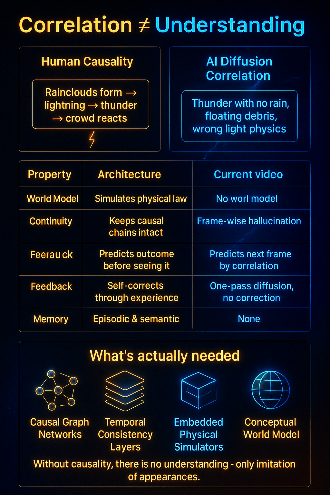
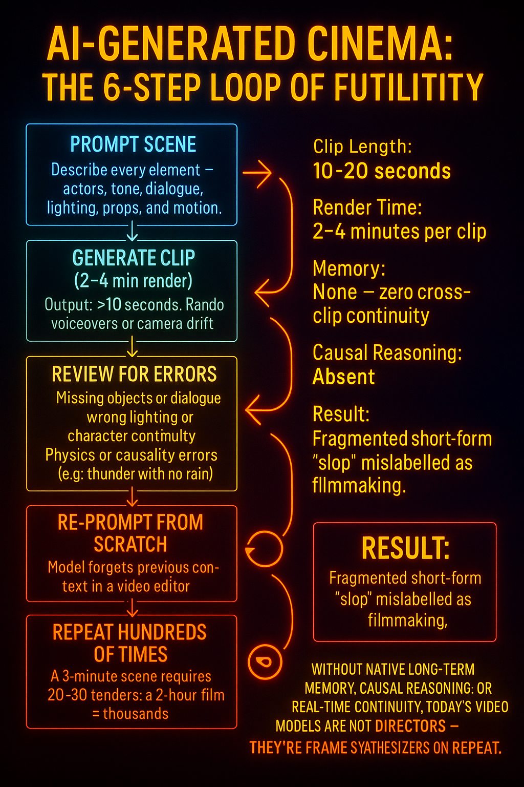

The Myth of AI Cinema: Why Current Video Models Are Overhyped

- [Introduction: The Cycle of Hype](#introduction-the-cycle-of-hype)

- [Architectural Limits](#architectural-limits)

- [Temporal Coherence Failures](#temporal-coherence-failures)

- [Lack of Physical and Causal Reasoning](#lack-of-physical-and-causal-reasoning)

- [Compute and Scalability Bottlenecks](#compute-and-scalability-bottlenecks)

- [Absence of Memory and Context Windows](#absence-of-memory-and-context-windows)

- [Why Hype Persists](#why-hype-persists)

- [Where Real Progress Lies: Super LLMs](#where-real-progress-lies-super-llms)

- [The Illusion of AI Cinema] {#illusion-of-ai-cinema}

Outline

🟦 Introduction: The Cycle of Hype

Describe the recurring ritual: every new video model triggers “Hollywood is dead” talk.
Explain how this comes from visual impressiveness, not actual reasoning capability.

⸻

⸻

🟥 Architectural Limits

Explain that video models use 3D or 4D diffusion (B, C, H, W, T), not transformer-style causal reasoning.
No capacity for understanding dialogue, narrative logic, or causality.
Lacks the reasoning depth of LLMs and future Super LLMs.

⸻

⸻

🟧 Temporal Coherence Failures

Videos last 10–20 seconds, maximum ~30 seconds in best cases.
Failures: object morphing, inconsistent lighting, characters teleporting,physics breaking  etc.
Explain why video coherence breaks (no memory between frames).

⸻

⸻

🟩 Lack of Physical and Causal Reasoning

Highlight your meteor and thunderstorm experiments.
Models fail at basic cause-and-effect: meteor trajectory, sound delay in lightning, human behavior realism.
Explain this as a missing causal world model layer.

⸻

⸻

⸻

🟨 Compute and Scalability Bottlenecks

Each 10–20s at max  clip takes minutes to render even on advanced GPUs.
Scaling to 1-hour films  would require millions in compute — entirely impractical.

⸻

⸻

⸻

🟫 Absence of Memory and Context Windows

Contrast with LLMs: video models have no tokenized memory, no recurrence, no persistent state.
They start fresh each clip — can’t recall scenes, props, or story context.

⸻

⸻

⸻

🟪 Why Hype Persists

Visual novelty is easy to sell.
Tech influencers mistake surface realism for intelligence.
The same cycle repeats with every new diffusion release (Haulio, Veo, Sora, etc.).

⸻

⸻

⸻

🟩 Where Real Progress Lies: Super LLMs

End with your thesis: true multimodal reasoning, agentic context management, and scientific understanding will only come from Super LLMs, not diffusion models.
Emphasize that language and reasoning are the foundation of intelligence — not pixels.

⸻

⸻

⸻

## Why AI Video Can’t Make a Movie Yet {#why-ai-video-cant-make-a-movie-yet}

### 🎥 The Illusion of Cinematic Intelligence

Modern video diffusion models—like Sora 2, Veo 3, or Haulio—produce visually stunning 10- to 20-second clips. 
But beneath the surface, there is no true understanding. These systems synthesize motion and texture, not meaning.

When asked to generate coherent scenes (“a thunderstorm strikes a skyscraper and people react”), 
they fail basic tests of physical and causal reasoning. Lightning flashes without thunder delay. 
Rain vanishes. Humans behave unrealistically. The model renders pixels—not physics.

⸻

⸻

⸻

### 🧠 The Missing Dimensions of Cognition

According to the **Dimensions of Cognition** framework, intelligence depends on seven interlocking abilities. 
Video models exhibit only one or two.

| Cognitive Dimension | Present in Video Models? | Why It Matters |

| **1. Flawless native long-term memory** | ❌ | No recall between clips; every prompt resets context. |
| **2. Deep scientific understanding & causal reasoning** | ❌ | Fails at physical cause-and-effect (motion, reaction, sound). |
| **3. Ingenuity & creativity** | ⚠️ | Only visual novelty, not conceptual invention. |
| **4. Omni-modality** | ⚠️ | Limited to fused video + audio; lacks text, code, or symbolic logic. |
| **5. Meta-thinking** | ❌ | Cannot self-correct or critique outputs. |
| **6. Pattern recognition** | ✅ | Excellent at realistic textures and human faces. |
| **7. Agentic autonomy** | ❌ | No internal goals, planning, or narrative intent. |

⸻

⸻

## Deep Scientific Understanding & Causal Reasoning {#scientific-understanding-reasoning}

Outline:

Definition:
What deep scientific understanding means in AI (deep mastery  of cause–effect modeling, world simulation,psycologial modeling  physical law inference).
Comparison Table:
intelligent  Humans: Understand physics, light, shadow, gravity, social cues.
Video models: Correlate pixel transitions, not causal dynamics.

Why it matters:
Without understanding, models can’t reason about what should happen.
Leads to “plausible nonsense” (e.g., lightning with no rain, floating debris, smoke with no combustion).

Architectural cause:
3D diffusion lacks internal world model.
No recurrent feedback loop or long-term causal memory.

Fix direction (future):
Causal JEPA-like architectures.
Integrated physics priors and symbolic simulators.

Conclusion:
True cinematic intelligence requires physical reasoning, not just spatial coherence.

which is  why every video generated by these models has the follwoing problems:

⸻

⸻

⸻

🟧 Temporal Coherence Failures

Videos last 10–20 seconds, maximum ~30 seconds in best cases.
Failures: object morphing, inconsistent lighting, characters teleporting,physics breaking, unrealistic human and animal behavior  etc.
Explain why video coherence breaks (no memory between frames).

⸻

⸻

⸻

🟩 Lack of Physical and Causal Reasoning

Highlight your meteor and thunderstorm experiments.
Models fail at basic cause-and-effect: meteor trajectory, sound delay in lightning, human behavior realism.
Explain this as a missing causal world model layer.

⸻

⸻

⸻

{width=750px fig-align="center" fig-cap="Causal Reasoning Failure"}

### 🧩 Why This Makes True Cinema Impossible

A film is not just pixels in motion—it’s **coherent narrative simulation**. 
Without memory, causal reasoning, and agentic intent, AI cannot maintain story logic, character identity, or scene continuity. 
That’s why today’s models can generate impressive fragments but no complete works.

⸻

⸻

⸻

⸻

### 🔮 The Path Forward

True cinematic AI will require models that integrate the missing six dimensions— 
**native long-term memory, causal reasoning, meta-thinking, and autonomy**— 
within a single multimodal architecture. 

Until then, what we call “AI cinema” will remain a brief illusion of intelligence: 
motion without mind.

⸻

⸻

⸻

⸻

## The Illusion of AI Cinema {#illusion-of-ai-cinema}

### 🎬 Production Impossibility

Even if today’s video models could generate flawless frames(which they absolutely cannot due to zero casual understanding and reasoning), making an actual film with them would still be unworkable.

Because these models have **no native memory or causal reasoning**, each 10-second clip must be treated as an isolated generation event. 
That means for every single scene, a creator must:

1. **Re-describe the entire context** — environment, characters, lighting, dialogue, mood. 
2. **Rebuild continuity manually** — since the model forgets everything once generation ends. 
3. **Wait minutes per clip** — modern diffusion pipelines require heavy GPU inference for each short render. 

For a 90-minute feature, that’s **540 separate 10-second videos** generated and stitched by hand — 
each prone to physical inconsistencies, emotional mismatches, and pacing errors.

> This isn’t creativity augmented by AI — it’s *fragmented asset generation masquerading as cinema.*

Until models gain long-term memory, temporal coherence, and causal reasoning, 
AI-generated movies will remain a logistical and cognitive impossibility.

{width=750px fig-align="center" fig-cap="AI Video Model Failure"}
