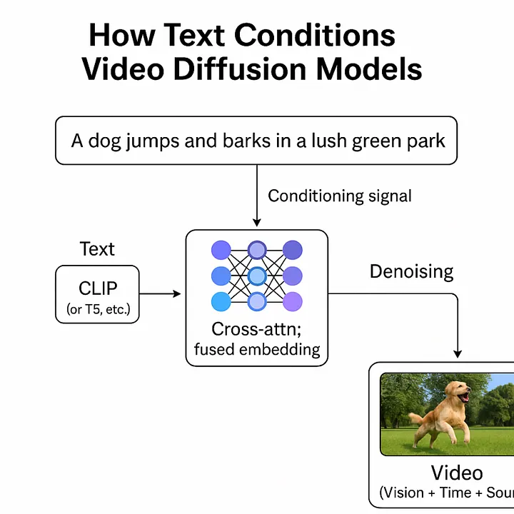
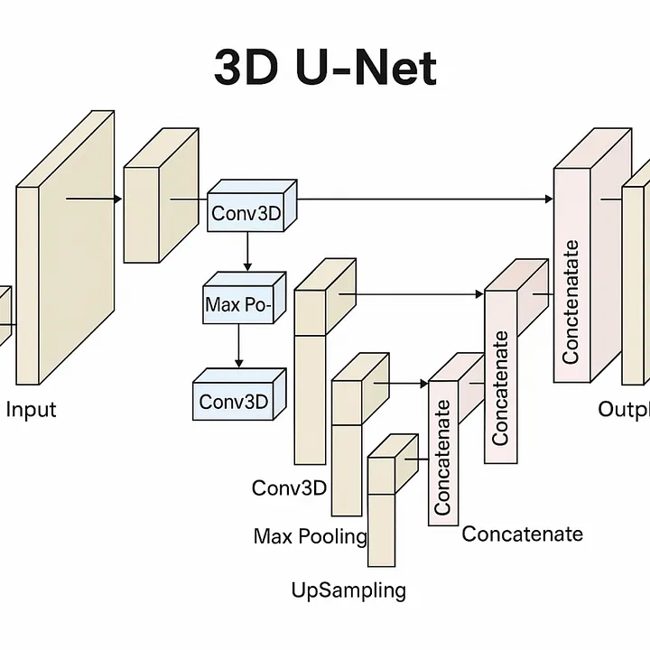
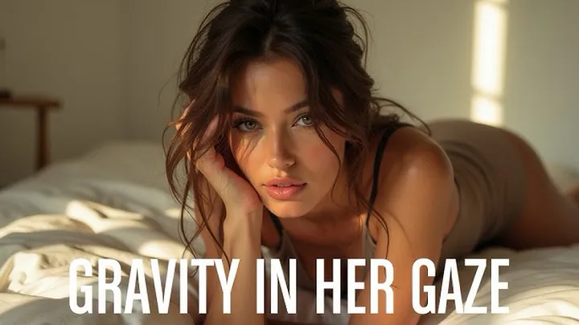
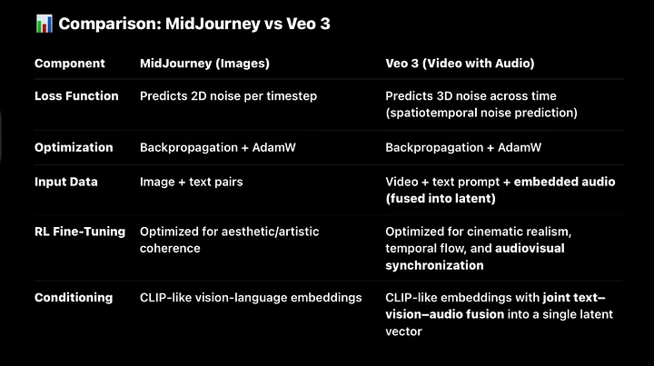

The Anatomy of Veo 3:DeepMind’s Audiovisual Diffusion Model

How 3D Convolution, Unified Latents, and Prompt Control Power the Future of Video Generation

🔹 Introduction

Veo 3 is one of the most advanced video generation models ever created – a 3D latent diffusion model capable of generating realistic, coherent, and high-resolution video from simple text prompts. Built on the same exact foundational principles as image diffusion models like Stable Diffusion or MidJourney, Veo 3 pushes those ideas into the temporal domain, operating not just across pixels but across time.

Where traditional diffusion models reconstruct single frames, Veo 3 generates entire video sequences – frame by frame, moment by moment – within a latent 3D space. This added temporal dimension introduces new challenges in coherence, memory, alignment, and detail, which Veo 3 overcomes through architectural and training innovations that make it a frontier model in multimodal AI.

This article breaks down how Veo 3 works: from its spatiotemporal latent U-Net backbone, to its use of Gaussian noising across video embeddings, to the inference pipeline that turns static prompts into vivid motion. We’ll explore why 3D latent diffusion works, how it’s trained, and what this tells us about the future of generative models beyond text and images.

🔊 Audio in SOTA AI: No Longer Standalone

In modern, state-of-the-art (SOTA) models, audio is no longer treated as a separate modality. Instead, it’s fused directly into the latent space of video models, aligned and synchronized over time.

When ML engineers or researchers. today say a model “understands video,” what they really mean is that it can process:

• Visual frames (images),

• Temporal structure (motion, continuity),

• Audio signals (waveforms or spectrograms).

Together, these form a single unified representation of video. There’s no longer an artificial split – video = vision + time + sound.

This latent fusion reflects how humans experience media: not as isolated images or sounds, but as continuous multisensory flows. AI models like Veo 3 aim to replicate this same integration – processing sight, sound, and motion as one dynamic stream, which makes the modality of video the go to for video generation and embodied models.

⸻

🎤 Standalone Audio: Now a Narrow Use Case

Standalone audio models (e.g., for ASR or TTS) still exist, but they serve limited functions:

• ASR (Automatic Speech Recognition): Maps waveform to text.

• TTS (Text-to-Speech): Maps tokens to waveform.

These are statistical mapping tasks, not comprehension. The model doesn’t “understand” speech – it learns to associate acoustic patterns with symbol sequences. There’s no reasoning, memory, or modality fusion.

🧠 Why 3D Diffusion Matters

Veo 3 is fundamentally a Stable Diffusion model – only extended to process video. Its real innovation isn’t a new architecture type, but a smarter embedding strategy:

→ 3D latent embeddings, which allow the model to jointly process patterns over time, space, and sound.

Veo 3 is very similar architecturally to MidJourney only it uses 3d layers

Just like DeepSeek’s MoE innovation centered on a new routing layer added to a mostly-standard transformer stack, Veo 3’s power lies not in reinventing diffusion – but in adapting it to dynamic data.

⸻

📉 From 2D Images to 3D Video

Traditional Stable Diffusion models operate in 2D latent space – i.e., (Channels × Height × Width). This works for static images, but collapses under the demands of video, which requires:

• Temporal consistency: Frame-to-frame continuity in object placement, motion, lighting, and style.

• Spatial coherence: Every frame must preserve perspective, geometry, and object persistence.

• Audio alignment: Sound must sync naturally with the visual timeline – especially for speech, music, and events.

⸻

🧠 Enter: 3D Latent Embeddings

Veo 3’s breakthrough is expanding the embedding space to include time as an explicit axis:

→ (Channels × Time × Height × Width)

This allows the model to learn:

• How objects evolve across frames

• How audio syncs with motion

• How scenes retain identity over time

This is not trivial. It turns every denoising step into a spatiotemporal optimization, requiring:

• A vastly more complex noise schedule

• Higher-dimensional convolutional layers (3D CNNs)

• Latent compression strategies (e.g., VAEs) to make the compute tractable

⸻

💡 It’s Still Diffusion – Just Smarter

At its core, Veo still applies the classic diffusion process:

1. Add noise to a video latent

2. Train a U-Net to denoise it over many steps

3. Reverse that process at inference to generate content

But instead of 2D latent images, it’s denoising entire video sequences – with a unified embedding of text, motion, sound, and space. This fusion is what makes the output coherent and lifelike.

🧠 U-Net Architecture in Veo 3 (3D Video Version)

U-Net Architecture in Veo 3 (Spatiotemporal + Audio Embedding 3D Video Version)

Veo 3 uses a 3D U-Net to guide the denoising process across space and time. Structurally, it’s nearly identical to the U-Net used in 2D diffusion models – the only major change is that all operations now happen on spatiotemporal latents (video = height × width × time).

Here’s what makes up the 3D U-Net in Veo:

⸻

🔹 1. 3D Convolutional Layers

• Use 3D kernels to extract patterns across height, width, and time but on feature maps that also encode audio cues.

• Filters scan the volume, capturing:

• Spatial features (e.g., texture, shape, object edges)

• Temporal features (e.g., motion continuity, transitions)

• As in 2D U-Nets, features become more abstract and semantically rich in deeper layers.

but on feature maps that also encode audio cues.

• These layers learn to associate:

• Visual movement with corresponding sound (e.g., lips moving with speech)

• Rhythmic or scene-based audio features (e.g., footsteps, ambient sound)

• Audio is fused into the latent volume – not processed separately.

Channels (Feature Maps)

• Each layer outputs multiple 3D channels:

• Early layers: detect static features (edges, color blobs)

• Deeper layers: detect motion flow, object tracking, lighting continuity

• Channels increase with depth: 32 → 64 → 128 → 256 → …

• Temporal-aware channels ( because they are part of a convolutional layer with 3d embeddings) allow. Hailuo to understand motion and continuity natively.

• Some channels are now explicitly tuned to audio-modulated patterns.

• E.g., waveform dynamics, spectral cues, or voice-emotion alignment.

• Deep layers may encode complex audiovisual relationships:

• Laughing + smiling

• Explosion + camera shake + sound boom

⸻
2. SiLU Activations (Sigmoid Linear Unit, aka Swish)

SiLU is a smooth, non-linear activation function widely used in state-of-the-art generative models like diffusion networks. It serves the same core purpose as ReLU – introducing non-linearity and filtering out weak signals

but with smoother transitions and better gradient flow.Unlike ReLU, which hard-zeroes all negative values, SiLU softly suppresses them using a sigmoid-weighted scale. This allows even small negative inputs to contribute to the output, resulting in a continuous and expressive activation pattern across layers.It doesn’t make negatives positive (like absolute value would).
• Mathematical Form:
text{SiLU}(x) =x cdot text|sigmoid}(x)
So:
• If * < 0, the sigmoid (x) is small → x is downscaled, not discarded
• If x > 0, sigmoid(x) is near 1 → x is mostly passed through SiLU is a deterministic non-linear activation function that does the same job ReLU does – only without hard-canceling gradients under zero. It suppresses them softly and projects a pattern-based continuation into the next layer. This smooth transition helps deep networks learn rich, abstract patterns while preserving signal detail across layers – a core requirement in architectures like diffusion U-Nets.
•, Why This Matters
SiLU enables:
• Smoother signal propagation
• Stronger gradient flow
• Fewer “dead neurons”
• Rich feature learning – especiall crucial for diffusion models, where
⸻

🔹 3. Group Normalization

Group Normalization – a normalization technique used in modern diffusion models instead of BatchNorm. It normalizes across groups of channels in each individual video making it more stable during training and effective for small batch sizes – which is common in generative models like MidJourney and Stable Diffusion.

Group Normalization still standardizes the features, just like BatchNorm – the difference is what it standardizes across.

GroupNorm: Normalize across groups of channels within each individual image

Batch norm is NOT used in State-of-the-Art diffusion models, group norm

What Both BatchNorm and GroupNorm Do:

They normalize the input features so that:

Mean ~ o
• Standard deviation ~ 1
This stabilizes training, accelerates convergence, and prevents exploding or vanishing gradients.
• Normalizes the output of feature maps within each individual image by splitting channels into smaller groups (e.g., 32 groups).
• • Unlike BatchNorm, it doesn’t rely on batch statistics, which makes it far more stable when batch sizes are small or variable – a crucial property for diffusion models.
• This normalization helps the model maintain consistent gradients and stable activations across noisy inputs during the denoising process.
• • Used in all modern diffusion architectures like Stable Diffusion.
⸻

🔹 4. Understanding Attention in Diffusion Models (U-Net style)

What Is Attention Doing in a Diffusion Model?

In video generation. attention helps the model:

• Focus on different parts of the video when making predictions, the model extracts different patterns from various video frames and then compares them to eachother to determine which patterns is most relavant to prediciting the next frame, this is called multi headed self attention 

• Relate different spatial regions to one another

• Align video regions to text prompts, This is known as multi headed cross attention

 Main Types of Attention in Diffusion Models

1. Multi headed Self-Attention

Self-Attention in Video Diffusion Models

• Compares every frame in the video with every other frame by leveraging 3D embeddings that combine vision, time, and sound modalities.

• Learns global temporal and cross-modal relationships across frames and audio, such as how certain visual phenomena relate across time or how sounds align with specific visual events.

• Typically placed at the bottleneck of the U-Net, where spatial and temporal dimensions are most compressed, to keep computation manageable while capturing broad context.

2. Multi headed Cross-Attention

Used in text-to-video models (e.g., sora, Veo 3, Hailuo )
• Attention flows from video → to text: each pixel region attends to semantic features in the text embedding (e.g., from CLIP)
Used for:
Aligning regions of the video to words in the prompt
 • Example: “dragon” → tail, wings, horns, texture

🔹 5.

Upsampling + Skip Connections( 2 separate layers but work together )

• In the decoder, the latent is gradually upsampled (restoring spatial and temporal resolution).

• Skip connections concatenate feature maps from earlier encoder layers.

• Bring back fine-grained spatial details lost during downsampling

• Combine low-level precision with high-level semantic context

• These connections are the backbone of reconstruction in video diffusion – preserving object shapes, motion paths, and transitions across frames.

These now carry audio-aligned visual information from earlier layers.

• The skip connections help the decoder align:

• Early spatial details (shape, color)

• Motion traces (object trajectory)

• Audio-driven cues (e.g., matching a bark to a dog’s open mouth)

⸻

🔹6.Layer Normalization:only occasionally used in Diffusion modles but primarily seen in Transformers as one of thier primary blocks:

(LayerNorm)

This layer standardizes the combined output across all features in the sample:

• Mean = 0

• Standard deviation = 1

📦 Applied per individual video embedding, not across the batch.

Why?

Because normalization makes learning stable and helps the model avoid overfitting to unusual variance in one part of the video.

SiLU layers are between each dense layer to ensure the greduents between them are passed to the next layer without loss of features as its goal is to upwards bound the gradients if its below 0

⸻

🔹 7.Final Output Layers

• Final 3D convolution maps the reconstructed latent to pixel space.

• During training: Compared to ground-truth video to compute loss.

• During inference: This is one frame group in a multi-step reverse noise trajectory – the model gets progressively clearer, frame-by-frame.

• Final convolution maps unified audiovisual latent into a coherent video.

• Video = Spatial frames + Motion + Aligned audio.

• During inference: Each step improves both visual clarity and sound consistency.

Veo 3’s U-Net denoises video + audio together – treating them as one coherent experience, just like how humans perceive the world. Every convolution, skip connection, and upsampling block operates on unified audiovisual latents, enabling:

• Synchronized speech and lip movement

• Emotion-aware sound design

• Coherent scene ambiance (visual + audio)

• Time-aware convolutional blocks

• Temporal skip connections

• Spatiotemporal denoising layers\

Veo 3’s U-Net denoises video + audio together – treating them as one coherent experience, just like how humans perceive the world. Every convolution, skip connection, and upsampling block operates on unified audiovisual latents, enabling:

• Synchronized speech and lip movement

• Emotion-aware sound design

• Coherent scene ambiance (visual + audio)

• Time-aware convolutional blocks

• Temporal skip connections

• Spatiotemporal denoising layers

state of the art diffusion U-Net:

• Conv2D

• Strided convolution

• GroupNorm

• SiLU

• Multi headed Self/Cross-Attention (positioned in mid/bottleneck layers)

• Residual blocks

• Skip connections

• Noise schedule

• Latent space sampling:allowing the model to extract patterns from billions of observations and combin them in novel ways, a standard feauture of foundation modles 

These are the same across both image and video generation

video=vison+time+sound

ow CLIP Guides Sampling in Video Diffusion Models

In modern video generation systems like Veo 3 or Sora, text prompts don’t just sit at the front of the pipeline – they actively guide the sampling process across the entire reverse diffusion trajectory. This is possible due to the multimodal fusion architecture behind models like CLIP (Contrastive Language-Image Pretraining) or CLIP-inspired modules adapted to video.

Text-to-Video Embedding Fusion
CLIP aligns visual and textual data in the same embedding space. When extended to video models:

• Visual tokens = extracted from video frames (via ViT or similar vision backbones)

• Text tokens = derived from prompts (via T5, GPT-style, or CLIP’s own text encoder)

• The model learns which textual descriptions correspond to which visual patterns over time

For video generation, these embeddings are not just matched – they are fused into the latent space used by the denoising U-Net.

2. Conditioning Sampling with CLIP Guidance

Once the model starts sampling noise latents in the diffusion process:

• The fused embedding acts as a conditioning signal

• This guidance signal biases the sampling trajectory toward areas in latent space that match the semantic meaning of the prompt

• Effectively, the prompt shapes the generation at every denoising timestep

This is similar in spirit to classifier-free guidance (CFG), but more semantically aligned, because CLIP encodes much richer multimodal relationships.

3. CLIP-like Fusion Enables Alignment

Because CLIP embeds language and visuals into a shared space, the model can:

• Interpret what “a tiger running through snow at sunset” should look like

• Sample from regions in latent space where such patterns exist across frames and time

• Maintain temporal consistency, spatial coherence, and audio alignment (when present)

This results in generation that’s not just realistic – but faithful to the prompt at a fine-grained level.

🧠 Note on Architecture:

Veo 3’s U-Net operates in spatiotemporal + audio space, meaning it preserves spatial, temporal, and acoustic continuity throughout the denoising process.

Unlike older models that flattened feature maps for dense layers, Veo 3 maintains full 3D structure at every layer. This ensures the model generates videos where motion, space, and sound stay synchronized – a key advantage over earlier generation systems.

Note: this is NOT drawn to scale, actual state of the art 3d diffusion models often have 100+ layers with a series of max pooling, residual, batch normalization, convolutional,dense, RELU layers stacked in a row. This is for visual representation only

⸻

🎬 The Denoising Pipeline: From Prompt to Video in Veo 3

At its core, Veo 3 is a 3D latent diffusion model, meaning it generates videos by reversing noise across space, time, and audio – not just pixel-wise. The process begins with pure noise and unfolds over many refinement steps, guided by a text prompt.

⸻

🔹 Step 1: Prompt Embedding (Text → Latent Guidance)

• A user types a prompt like:

“A lion walking through a golden savanna at sunset, with ambient nature sounds.”

• This prompt is passed into a powerful text encoder, likely a CLIP-like model fine-tuned on video-text pairs.

• The encoder outputs a dense semantic embedding, which represents the prompt’s meaning and guides the entire video generation process.

✅ Why this matters:

The model doesn’t “understand” words – it maps them to a multi-dimensional vector that captures how the text should feel, move, and sound in video form.

⸻

🔹 Step 2: Noise Initialization (Latent Space Start)

• Veo 3 starts with pure Gaussian noise in a latent space shaped like:

[Channels, Frames, Height, Width]

• This latent space is multi-modal: it encodes not just video frames, but temporal structure and audio embeddings.

• This is not RGB pixels yet – it’s a compact, high-dimensional representation of a video.

🎧 Remember:

Audio is already embedded into this latent – Veo 3 learns to co-model sound and motion over time. There’s no need to model it separately.

⸻

🔹 Step 3: Conditioned Denoising (U-Net Iterations)

This is the core of Veo 3’s magic – a large 3D U-Net refines the noisy latent over dozens or hundreds of steps.

🔧 U-Net Internals (Each Step):

1. Downsampling

• Uses 3D convolutions + max pooling to shrink resolution while expanding channels.

• Captures high-level patterns: motion arcs, scene layout, audio cadence.

2. Bottleneck

• The deepest layer of the U-Net.

• Composed of stacked convolutional layers, ReLU, Batch Normalization, and residual connections.

• This is where the model detects global structures like rhythm, spatial continuity, and scene tone.

3. Upsampling + Skip Connections

• Spatial resolution is gradually restored using upsampling layers.

• Skip connections bring in features from earlier layers – preserving detail lost during downsampling.

• These connections are essential for generating crisp, temporally consistent results.

🎯 Key Insight:

This denoising stage reverses entropy – turning chaos (random noise) into structured meaning.

Each step brings the latent closer to something semantically aligned with the prompt.

⸻

🔹 Step 4: Output Projection (Latent → Video)

• Once the latent has been fully denoised, it is passed through a decoder that maps the latent to actual video frames.

• Audio is either reconstructed from the audio channels of the latent or synthesized in parallel via a dedicated audio decoder (if present).

• The result: a fully rendered RGB video + synchronized soundtrack.

✅ Summary: The Pipeline at a Glance

Text Prompt

. ↓

CLIP-style Text Encoder

. ↓

Semantic Embedding

. ↓

Gaussian Latent Noise

. ↓

3D U-Net

. ↳ Downsample → Bottleneck → Upsample + Skip Connections

. ↓

Denoised Latent

. ↓

Decoder

. ↓

Final Video (with Sound)

Generated by veo 3

🔸 Video’s Richness Comes at a Cost

Video is the most information-dense modality – combining space, time, motion, and sound – which makes it the ideal training ground for world modeling. But that same richness makes it the hardest to model. The input dimensions of video (especially with high resolution, long duration, and audio) are massive.Even state-of-the-art generative models like Sora and Veo 3 can only produce video in short bursts – typically under one minute – before quality degrades or coherence breaks.Why? Because the computational demands of processing and generating high-fidelity video over time are still immense. Training on video is also harder: unlike static images, video requires modeling temporal continuity, physical realism, and synchronized audio – all within an enormous latent space. Video is where AI learns the structure of reality – but it’s also where today’s models hit their computational limits. That richness is exactly what makes video the ideal domain for video generation and world modeling – but also the hardest to generate.

🎥 Even frontier models like Veo 3 and Sora are typically limited to generating clips at most 1 minute and and usually less. Beyond that, quality drops, motion becomes erratic, and coherence breaks down.

The Bottleneck:

Training generative video models at this scale requires:

• Enormous compute budgets

• Optimized 3D latent architectures

• Smart sampling and memory handling

• Massive, diverse video + audio datasets

Even with all that, we’re still far from true long-form generation.

Until architectures can scale efficiently across space, time, and sound,

→ long, coherent, simulation-level videos will remain just out of reach – even at the frontier.

🎯 9. Why This Matters

Veo 3 isn’t just another step in generative modeling – it’s part of a paradigm shift:

From generating isolated images or text → to modeling the flow of reality itself.

⸻

🔸 A Frontier in Video Generation

Veo 3 pushes diffusion modeling into 3D latent space, enabling high-fidelity video generation that spans:

• Space (visual realism, object placement),

• Time (temporal continuity, motion),

• Sound (synchronized audio alignment with events).

It captures not just what’s in a scene, but how that scene evolves – frame by frame, second by second, with increasing semantic depth.

This is the next frontier after LLMs and image models:

→ Models that simulate unfolding events, not just describe them.

This is why Veo 3 and similar models matter:

They’re training grounds for AI to internalize the logic of the real world – to go from static reasoning to dynamic, embodied understanding.

⸻

🧠 Loss Function & Optimization (Training-Time Only)

While Veo 3’s exact training pipeline hasn’t been made public, it almost certainly follows the same principles used across state-of-the-art diffusion models. What distinguishes these models is not some radically new loss function – it’s how effectively they scale and apply known techniques across the spatiotemporal and audiovisual domains.

⸻

🔹 Loss Function: Predicting Noise – But Now in 3D

Like Stable Diffusion and MidJourney, Veo 3 likely uses denoising score matching as its core training objective.

The model learns to predict the noise that was added to video latents during the forward diffusion process.

The core loss is still a mean squared error (MSE):

L = \mathbb{E}{x, \epsilon, t} \left[ \| \epsilon – \epsilon\theta(x_t, t, c) \|^2 \right]

Where:

• x_t: the noised latent video at timestep t

• \epsilon: sampled Gaussian noise

• \epsilon_\theta: the model’s prediction of the noise

• c: the conditioning (e.g., text prompt, image input)

The model is trained to reverse the Markov chain of noise added to videos – just like in image diffusion – but applied to 3D tensors (video = frames × height × width), often with audio embeddings fused into the latent space.

At each step:

• The model predicts the noise that was added,

• Loss is computed on that prediction,

• Over time, it learns to denoise more precisely – frame by frame, moment by moment.

The only difference: instead of denoising a static image, Veo 3 denoises a temporal sequence of frames, preserving motion, scene continuity, and audio alignment.

⸻

🔹 Optimization: Backpropagation at Scale

Like most cutting-edge models, Veo 3 almost certainly uses:

• Backpropagation

• An adaptive optimizer like Adam or AdamW

• A learning rate scheduler to manage convergence over tens of thousands of steps

The key differences lie not in how it optimizes, but in what it’s optimizing over:

• Massive video-text-audio datasets (likely scraped from public content or synthetic corpora)

• 3D latent spaces with high memory demands

• Fused conditioning signals (e.g., prompt + image + audio)

Veo 3 may also benefit from:

• FP16 / bfloat16 precision training

• Gradient checkpointing for memory efficiency

• DDP or ZeRO-style parallelism across huge GPU clusters

⸻

🔹 Reinforcement Learning for Temporal Coherence and Aesthetic Quality

Just as MidJourney likely uses RLHF to guide its aesthetic tuning, Veo 3 probably applies a similar process for:

• Motion stability

• Scene consistency

• Prompt alignment

• Audio-visual sync

User interactions (e.g., prompt rerolls, positive feedback) could serve as soft reward signals. Additionally:

• Human feedback may be used to penalize bad generations (e.g., glitchy motion, out-of-sync audio)

• Preference modeling can prioritize outputs with stronger emotional or cinematic resonance

This allows the model to not just “remove noise,” but to learn patterns of realistic, engaging, and coherent video sequences.

This section frames Veo 3 as more than a content tool – it’s a simulation backbone for the future of physical and virtual agency.

🔁 Diffusion Loss Functions Are Universally Shared Across Modalities

Whether you’re training:

• 🌁 A 2D diffusion model (e.g., Stable Diffusion,midjourney )

• 🎥 A 3D video diffusion model (e.g., Veo 3, Hailuo)

• 🧠 Even audio diffusion models (e.g., AudioLDM)

…the core objective remains the same:

🎯 Predict the noise added at each step of a Markov forward process using MSE (or a related denoising loss).

This means:

• ✅ Same U-Net style architecture (with dimension-specific Conv blocks)

• ✅ Same time-step conditioning

• ✅ Same reverse process using noise prediction

• ✅ Same optimization: backpropagation + AdamW or variants

• ✅ Same high-level training loop

Even models like Veo 3 or Hailuo, which generate temporally coherent video, still use the same denoising loss – just applied to 3D tensors that span width × height × time × channels. The only difference is that the input is larger and more complex( video which includes: vision+ time+ sound )but the. structure innterme of layers and sequence is unchanged.

⸻

💡 Human RL (Reinforcement Learning)

And yes – Reinforcement Learning from Human Feedback (RLHF) or curated preference modeling (as used in OpenAI’s video & image models) comes after this main denoising process, as a form of reward alignment or ranking optimization. This layer is added only if:

• The outputs are being ranked/scored by humans

• You want to bias the model toward user preference (e.g., smooth motion, aesthetic lighting, natural pacing)

⸻its exactly the same minus a 2d embedding space vs a 3D one.

🔸 New Frontiers in Multimodal Creativity

Video models open the door to creative workflows never before possible:

• Prompt-to-video storytelling

• Procedural content generation for games and simulations

• Cinematic video generation from script-level guidance

• AI-generated visual education, science explainers, or dream sequences

As diffusion-based video models mature, they will radically change how content is created – from filmmaking and education to design, gaming, and simulation.

Veo 3 isn’t just about video generation.

It’s about teaching machines to understand and recreate the temporal structure of the real world —

A core requirement for truly intelligent systems.