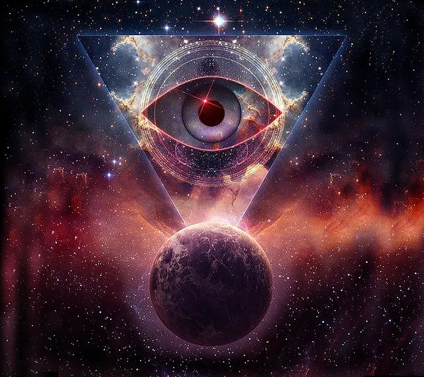
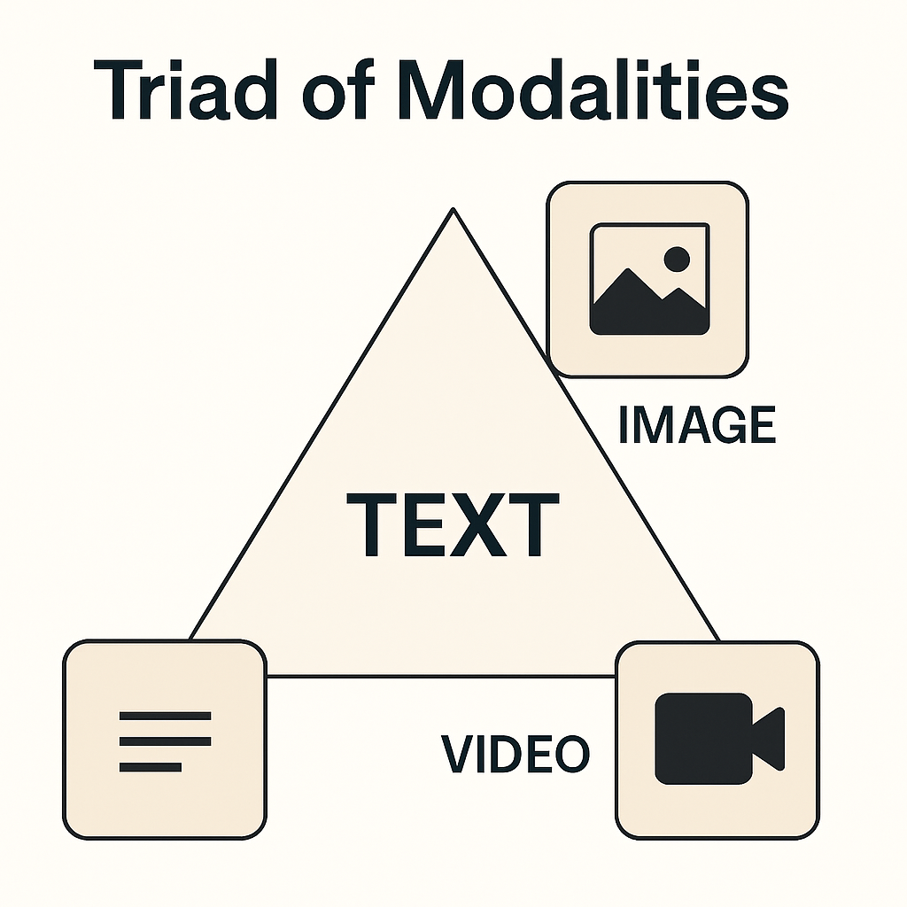
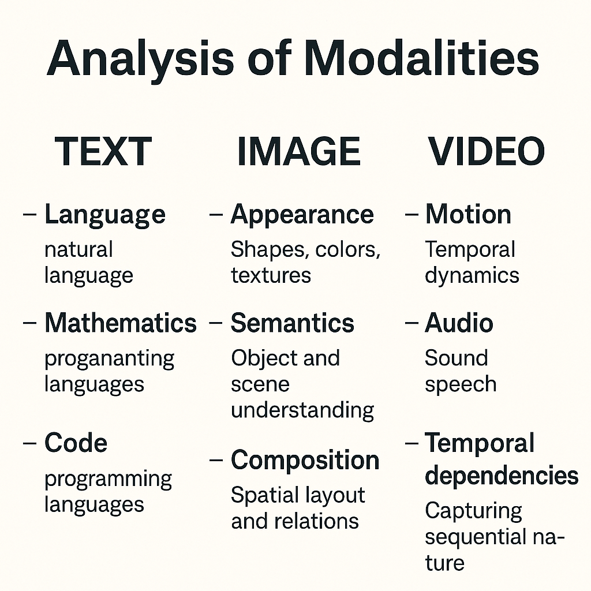

OmniModels: The Unified Architecture for Intelligence

Imagine walking down a busy street: you don’t first hear sounds, then separately see shapes, then later recognize movement. Instead, your brain processes it all as one continuous, unified experience.OmniModels aim to replicate this natural fusion only with far greater speed, efficiency and volume . — AI systems that don’t just recognize individual signals, but synthesize a coherent stream of perception across text, images, video, and audio

⸻

Introduction

True intelligence, whether human or artificial, emerges not from isolated perception, but from coherence across senses. You don’t just hear a dog bark — you see its mouth move, feel the tension in the air, and anticipate what might happen next. This fluid integration of modalities is what gives rise to understanding, prediction, and agency.

Historically, AI systems have been siloed into one modality. — language models, vision models, audio models — each excelling within narrow domains. But as we approach Artificial General Intelligence (AGI), that separation becomes a bottleneck. Intelligence must not only handle multiple modalities — it must unify them into a single cognitive flow.

This is where OmniModels come in: architectures designed to perceive, reason, and generate across all modalities — text, image, video, and audio — inside a shared latent space. They don’t just switch between senses. They synthesize them.

Omnimodal mastery isn’t a luxury — it’s a prerequisite. For embodied agents that navigate the real world, for creative systems that compose across media, and for intelligent machines that think not in fragments, but in unified streams of experience.

⸻

🔍

🔍
🔍 What Is an OmniModel?

OmniModels are AI systems that can perceive, reason, and generate across all core modalities — text, image, video (spatiotemporal + audio), and audio transcription — inside a coherent shared embedding space.

At the frontier:

• Text grounds semantics and symbolic reasoning

• Images provide spatial and contextual detail

• Video fuses space, time, and sound into a sensory timeline

• Audio is increasingly fused within video latents or serves as a transcription layer

One key shift in modern AI is how audio is handled. Unlike before, audio is rarely treated as a standalone input anymore. Instead, it’s deeply fused within video streams — combined with visual frames and temporal cues into a single, rich representation.This makes video the most information-dense modality today, integrating sight, sound, and motion into one seamless flow for AI to process.

🔺 The Triad of Sensory Modalities in Modern AI

The Triad of Modalities in state of the art AI

As of 2025, state-of-the-art multimodal models have largely converged around a core trio of modalities:

⸻

Text
• The backbone of semantic reasoning and instruction-following

• Serves as both input (prompts, commands) and output (summaries, completions)

• dialogue, mathematics, language generation, language translation code. and symbolic inference

⸻

2. Images

Capture static spatial structure — objects, scenes, relationships, colors, people
• Provide visual grounding for context and environment
• Used in tasks like classification, captioning, and visual Q&A
⸻

3. Video (which includes audio)

Now the richest and most information-dense modality
• Fuses:
• Spatial (frame-by-frame imagery)
• Temporal (motion, sequencing, action)
• Auditory (speech, environmental sounds, music)
• Encoded as a unified stream in 3D latent spaces (x, y, t), with audio embedded directly alongside visual motion🔊 Note on Audio:
Audio is no longer treated as an independent, standalone modality in SOTA models. Instead, it is fused directly within video latents — synchronized and aligned over time.
Standalone audio still plays a role but only in transcription (speech → text) or TTS (text → speech) via specialized models. In these cases, the model maps acoustic signals to tokens via pattern recognition, not reasoning. It doesn’t understand speech — it matches phonetic patterns to labeled examples in its training set and generates the corresponding text. There’s no deep comprehension involved, just statistical alignment between sound and symbol.

⚡ Why This Matters

When ML engineers and researchers today talk about “multimodal” AI, they are usually referring to systems that master this triad:

• Text: Language, prompts, instructions,mathematics,code,base pairs

• Images: Static visual understanding

• Video: Time + visuals. + sound

The shared embedding space is trained to fuse and align these inputs such that:

• A dog barking in video aligns with the audio waveform and the caption “dog barking.”

• Lip movement syncs with speech audio.

• Narration connects with scene changes.

Most Models Aren’t Truly Multimodal (Yet) and NONE are omnimodal

While many current AI systems are marketed as “multimodal,” they’re usually not unified under the hood.In practice, today’s models are often unimodal backends — a language model, a vision model, maybe an audio model — loosely stitched together through API. tools. This creates the illusion of fluid multimodal reasoning, but the components don’t share a common understanding or latent space.These pipelines pass tokens, not meaning.

True multimodality requires a shared embedded representation of all inputs across all of the modalities — fused across space, time, and semantics. That’s what OmniModels aim to achieve natively.

For example, when you use GPT-4 to generate an image, recognize one, or read text aloud, it’s not GPT-4 doing all those things. It’s GPT-4 (a language model) calling other specialized models:

• A diffusion model. (e.g. DALL·E or similar) for image generation

• A vision encoder (like. vision transformer ) for image interpretation

• A text-to-speech engine for voice output

These models don’t share weights or a common representation — they’re bolted together. What seems like fluid multimodal reasoning is really a handoff between separate systems.OmniModels change this. They fuse all modalities — text, image, video, and audio — into a shared latent space. They don’t just talk to each other. They think together.

🧠 Why Unification Matters

Unified perception isn’t just an architectural upgrade — it’s a cognitive necessity. OmniModels enable:

• ✅ Unified perception — Fusing visual, auditory, and linguistic streams into one coherent mental model

• ✅ Cross-modal reasoning — Aligning lips with voice, syncing narration with scene changes, translating sensory data across modalities

• ✅ Embodied cognition — Powering AI agents that perceive and act across vision, audio, and language

• ✅ Natural interaction — Supporting flexible input/output interfaces: speech, video, writing, images

• ✅ Unified generative abilities — Creating outputs that span text, images, video, and synchronized audio from a single internal representation

Without this synthesis, no model can understand the world holistically. Omnimodal AI is the perceptual bedrock of AGI.

🧠 The Unified Architecture: Inside an Omnimodal Brain

Omnimodal intelligence is powered by a shared latent space — a vector field where text, images, video, and audio are represented together. This allows the model to learn modality-agnostic concepts and generate outputs that span them all.

🔗 Shared Embeddings

Rather than keeping modalities separate, OmniModels project all sensory data into the same latent geometry:

• A caption, image, and audio clip referring to the same event will occupy nearby regions

• Semantic similarity, not modality type, determines proximity

• This enables cross-modal generation (e.g., text → video + sound)

🔁 Cross-Modal Alignment

It’s not just about joint space — it’s about aligned timelines. For instance:

• Lip movement ↔ voice

• Scene transitions ↔ narration

• Visual explosion ↔ audio “boom” ↔ caption “explosion”

This temporal and semantic alignment allows the system to understand and generate from multimodal input as a unified experience.

🔄 Interleaved Inputs

You might ask:

• “Here’s an image of my car. Can you tell me what the sound in this video is?”

• “Here’s a story in text — turn it into a video episode with sound.”

In an OmniModel, that’s one smooth request. All inputs are encoded into a single interoperable latent stream.

⸻

🛠️ Technical Deep Dive: How OmniModels could Fuse Modalities

Stage 1: Modality-Specific Front-End Encoders

Each sensory type has its own encoder:

• 📝 Text → Tokenized + passed through a Transformer

• 🖼️ Image → Processed with ViT( vision transformer )or CNN

• 🔊 Audio → Encoded via wav2vec2, Whisper, or spectrogram tokenizers

• 🎥 Video → Passed through 3D CNNs or spatiotemporal transformers because video itself inately includes audio + time + vision they are embedded in one core vector, one video, one vector.

Stage 2: Projection into Shared Embedding Space

All encoded modalities are projected into a common latent space using:

• 🔁 Linear projection heads

• 🔁 Contrastive alignment (e.g., CLIP, Flamingo)

• 🔁 Cross-attention layers to blend modalities

This space is where semantic fusion happens. A moment in video, a spoken phrase, and a sentence — all become neighbors in representation.

Stage 3: Temporal-Spatial Fusion for Video + Audio

Video and audio require time-aware embeddings:

• 🎥 3D Vision Transformers align spatial movement

• 🔊 Audio transformers sync waveforms with visual frames

• 🧠 Time-position embeddings let the model understand sequence and flow

Example: “The dog barked” → fused input from:

• Text: “dog barked”

• Image: mouth open

• Audio: waveform

• Video: motion

Stage 4: Joint Attention & Interleaved Transformers

After fusion:

• One transformer backbone attends across all modalities

• Example: GPT-4o uses interleaved token streams where audio, image, and text co-attend inside the same layers

Older models (e.g., Flamingo) used perceiver-style frozen vision encoders. OmniModels break that wall.

Stage 5: Unified Generation Heads

From a shared latent, OmniModels can:

• 🧠 Generate video (e.g., Sora)

• 🖼️ Create images (e.g., Midjourney)

• 🔊 Produce audio or music (e.g., AudioCraft)

• 📝 Complete text

• 🗣️ Read text out loud or transcribe speech

It’s one brain, many outputs — not one model per modality

Even though the promise of OmniModels is clear, we’re not there yet. Today’s SOTA models are still constrained by several architectural and infrastructure bottlenecks:

🔸 No Shared Backbone Across Modalities

Most models are built for one primary modality — LLMs for text, ViTs for images, 3D CNNs or temporal transformers for video. There’s no single architecture that natively fuses all of them into one dynamic, learnable structure.

🔸 Misaligned Training Objectives

Text models are trained with autoregression. Vision models often use contrastive learning. Video models work with temporal prediction. These differences make it difficult to unify their embeddings in a way that’s semantically meaningful across modalities.

🔸 Compute Bottlenecks

True video+audio modeling is extremely compute-intensive. Handling high-dimensional video+audio+text streams in a unified transformer — with interleaved attention — isn’t feasible for most labs or organizations yet.

🔸 Lack of Cross-Modal Supervision

Large-scale datasets that align video, text, and audio (beyond captions) are rare. We lack ground truth labels or self-supervised tasks that teach a model to jointly reason across senses — not just correlate them.

🔸 Current Models Are Orchestrated, Not Unified

As mentioned earlier, most “multimodal” systems today are collections of unimodal models wired together via APIs. This limits their ability to develop persistent memory, continuity, or causal understanding across modalities.

Until these bottlenecks are addressed — either through better architectures (e.g. universal transformers), more efficient training paradigms (like JEPA), or massive cross-modal pretraining corpora — true OmniModels will remain just over the horizon.

🔸 Video’s Richness Comes at a Cost

Video is the most information-dense modality — combining space, time, motion, and sound — which makes it the ideal training ground for world modeling. But that same richness makes it the hardest to model. The input dimensions of video (especially with high resolution, long duration, and audio) are massive.Even state-of-the-art generative models like Sora and Veo 3 can only produce video in short bursts — typically under one minute — before quality degrades or coherence breaks.Why? Because the computational demands of processing and generating high-fidelity video over time are still immense. Training on video is also harder: unlike static images, video requires modeling temporal continuity, physical realism, and synchronized audio — all within an enormous latent space. Video is where AI learns the structure of reality — but it’s also where today’s models hit their computational limits.

Until we build architectures that scale efficiently across spatiotemporal + audio dimensions, long-form, simulation-grade video generation will remain constrained — even at the frontier.

 

🤝 Toward Richer Human — AI Collaboration

Today, working with AI often feels like speaking a second language:

You prompt. It responds. You adapt to its quirks.

But in the future — with OmniModels — collaboration will feel more like interacting with another mind.

When AI can:

• See what you see

• Hear what you hear

• Understand your tone, gesture, and intent

• Respond in any medium — naturally and synchronously

…it becomes more than a tool. It becomes a fluid partner — able to assist, anticipate, explain, and co-create.

OmniModels will enable:

• 🎥 Co-creative workflows: Describe a scene, and the AI builds it — visually, aurally, and narratively

• 🧠 Visual & auditory memory: AI that remembers what it sees and hears, not just what you type

• 🗣️ Natural conversation: You speak, show, and sketch — the model understands context from all of it

• 🛠️ Multimodal debugging & teaching: AI watches your workflow, listens to your feedback, and learns how to help more intelligently

This is the beginning of intelligence as a medium — not locked in text or code, but flowing across vision, sound, language, and motion.

OmniModels won’t just power simulation.

They’ll power collaboration that feels truly natural.

A list of some prompts you an omni modal ( especially if its an omnimodal world model) model could easily do. if achieved

🔍 Perception + Reasoning

1. “Watch this video and summarize everything the teacher is trying to communicate — not just in words, but in tone, gestures, and visual aids.”

2. “Here’s an audio clip of footsteps and a video of a hallway. Match the sound to the person in the video and explain your reasoning.”

3. “Listen to this scene and generate an image of what the room likely looks like, based on the sounds and dialogue.”

⸻

🧠 Cross-Modal Abstraction

4. “Here’s a picture, a short audio clip, and a paragraph. Find the common concept they’re all referencing, and explain it abstractly.”

5. “I’m uploading a story, an illustration, and a video scene — identify the underlying emotional theme and predict how a character will act next.”

⸻

🎨 Unified Generative Creativity

6. “Here’s a text description of a sci-fi world. Generate a long animated video with sound and music that matches the tone,characters. and pacing.”

7. “Convert this podcast episode into a visual explainer video with synced subtitles, motion graphics, and background music.”

8. “Given this image and this ambient soundtrack, generate a narrated short story that fits the mood of both.”

⸻

🧩 Simulation & Agency

9. “Watch this video of a person assembling IKEA furniture. Describe the physical steps they took and simulate what happens if they skipped Step 3.”

10. “Here’s a drone flyover video of a disaster site. Analyze the situation, estimate damage zones, and describe where to send emergency responders — explain your reasoning.”

⸻

👥 Natural Interaction + Mixed Input

11. “I’ll describe the issue with my car in text, show you a photo, and play a short audio of the engine. Diagnose the most likely problem.”

12. “Here’s a drawing my kid made. Can you turn it into a 15-second story animation, narrated in their voice?”

13. “Read this technical article aloud, but pause after each section to explain it in simpler terms using visual aids like long form videos or imagery “

⸻

💡 Reasoning Over Time & Modality

14. “Here’s 10 minutes of video surveillance from a store. Detect anything unusual — behavioral, auditory, or visual — and explain why it stands out.”

15. “Here’s a video with no audio, and a transcript of what was said. Reconstruct the synced audio with realistic voices, background sounds, and correct timing.”

The dream isn’t just a model that sees and talks. It’s an agent that can learn like us — through experience, not instructions. This is obviously not the only breakthrough needed for AGI( which is super far away) but OmniModels are one of the architectural keys to that door.

AI, Machine Learning, Deep Learning, Multimodal, Artificial Intelligence

🧠 Curious about the other parts of the what is needed to reach true AGI?

OmniModels are critical capability for general intelligence – the ability to process and learn across all modalities ia crucial but not enough
